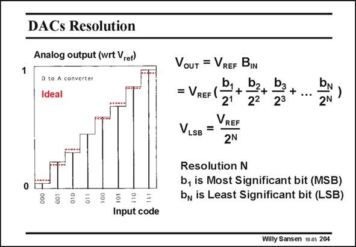

# SANSEN-204 · DACs Resolution

章节：20 CMOS 模数与数模转换原理  
PDF 页：593；书本页：604；幻灯片编号：204  
状态：unreviewed



## 对应教材讲解

### PDF 593 · 书本 604

The number of steps taken is called the resolution. The value of the analog output voltage now depends on which bits b are 1 or 0. For example, for a code 110 and a reference voltage of 0.6 V, the output voltage is 0.6×(2−1+2−2) or 0.45 V. For a resolution N, the smallest step V is the ref- LSB erence Voltage divided by 2N. For example this is 1/256 or 0.4% for a 8 bit converter, or 2.3 mV for a 0.6 V reference voltage. The error must always be smaller than the resolution. The coefficient of 1/2 is the most significant bit, whereas the coefficient of the last one 1/2N is the least significant bit.

## 公式／性能结论候选摘录

以下为规则截取的原文，尚未逐项判读。

- PDF 593: The value of the analog output voltage now depends on which bits b are 1 or 0.

## 曲线结论候选摘录

以下为规则截取的原文，尚未逐项判读。

（未由规则找到；不代表原页没有此类内容。）

## 原文条件与近似候选摘录

以下为规则截取的原文，尚未逐项判读。

（未由规则找到；不代表原页没有此类内容。）

## 幻灯片 OCR（未校正）

```text
DACs Resolution
Analog output (wrt Vref)
D to A converter
Ideal
0
VoUT = VREF BIN
b,
= VREF (
+
bz+
b3.
+
21
22
23
2N
VREF
VLSB =
2N
Resolution N
b, is Most Significant bit (MSB)
bn is Least Significant bit (LSB)
Input code
Willy Sansen 10 0s 204
```

数学上下标、分数及正负号以原图为准。电路图已保留；未核对的连接不输出成可仿真 netlist。
