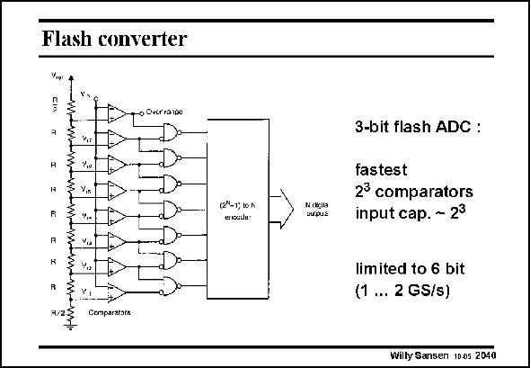

# SANSEN-2040 · Flash converter

章节：20 CMOS 模数与数模转换原理  
PDF 页：612；书本页：623；幻灯片编号：2040  
状态：unreviewed



## 对应教材讲解

### PDF 612 · 书本 623

The fastest ADCs are undoubtedly flash converters, as shown in this slide. The reason is that they process the input voltage in parallel. Only one single clock cycle is required. The previous ones process the bits in series, and are therefore slower. A large number of input comparators are used to compare the input signal with a (thermometer) fraction of the reference voltage V . The outputs of the ref comparators generate a thermometer code, which is converted into binary code by an encoder. The comparators are followed by NAND gates. Their outputs are all zero except for the one which sees a difference at its inputs, i.e. where the thermometer code changes from zero to one. The main disadvantage of such an ADC is the large number of comparators required. For a 6-bit flash converter 26 or 64 comparators are required! This is why such converters have very limited resolution. Moreover, the input voltage sees all comparators in parallel, which represents a very large input capacitance. It will take a lot of power to drive this converter.

## 公式／性能结论候选摘录

以下为规则截取的原文，尚未逐项判读。

- PDF 612: The previous ones process the bits in series, and are therefore slower.
- PDF 612: This is why such converters have very limited resolution.

## 曲线结论候选摘录

以下为规则截取的原文，尚未逐项判读。

（未由规则找到；不代表原页没有此类内容。）

## 原文条件与近似候选摘录

以下为规则截取的原文，尚未逐项判读。

（未由规则找到；不代表原页没有此类内容。）

## 幻灯片 OCR（未校正）

```text
Flash converter
Vnsi
ToOuirisin
Do
3
R
",.
Comparators
(2°-1; в0 K
ensaJe:
N digila
wupua
3-bit flash ADC :
fastest
23 comparators
input cap. - 23
limited to 6 bit
(1 ... 2 GS/s)
Willy Sansen 1005 2040
```

数学上下标、分数及正负号以原图为准。电路图已保留；未核对的连接不输出成可仿真 netlist。
