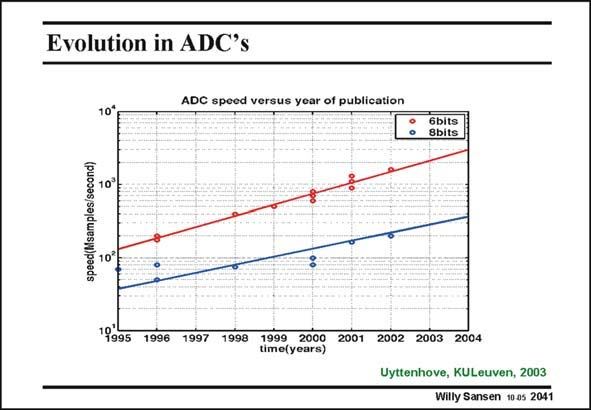

# SANSEN-2041 · Evolution in ADC's

章节：20 CMOS 模数与数模转换原理  
PDF 页：613；书本页：624；幻灯片编号：2041  
状态：unreviewed



## 对应教材讲解

### PDF 612 · 书本 623

To give an idea of what flash ADC’s have been realized, a plot is given with the flash ADCs published in the JSSC. Both the 6-bit and 8-bit examples, show a trend of increasing speed, as a result of the availability of ever deeper submicron CMOS technologies.

### PDF 613 · 书本 624

Extrapolation shows that by 2008, the 8 bit flash ADCs will probably reach 1 GS/s and the 6-bit ones 12 GS/s, which is quite impressive indeed!

## 公式／性能结论候选摘录

以下为规则截取的原文，尚未逐项判读。

- PDF 612: Both the 6-bit and 8-bit examples, show a trend of increasing speed, as a result of the availability of ever deeper submicron CMOS technologies.

## 曲线结论候选摘录

以下为规则截取的原文，尚未逐项判读。

- PDF 612: To give an idea of what flash ADC’s have been realized, a plot is given with the flash ADCs published in the JSSC.

## 原文条件与近似候选摘录

以下为规则截取的原文，尚未逐项判读。

（未由规则找到；不代表原页没有此类内容。）

## 幻灯片 OCR（未校正）

```text
Evolution in ADC's
ADC speed versus year of publication
10*
6bits
8bits
speed(Msamples/second)
10₴
10°
"995
1996
1997
1998
1999 2000 2001 2002 2003 2004
time(years)
Uyttenhove, KULeuven, 2003
Willy Sansen 10 a5 2041
```

数学上下标、分数及正负号以原图为准。电路图已保留；未核对的连接不输出成可仿真 netlist。
