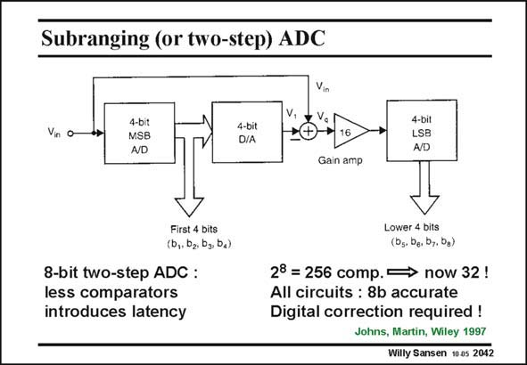

# SANSEN-2042 · Subranging (or two-step) ADC

章节：20 CMOS 模数与数模转换原理  
PDF 页：613；书本页：624；幻灯片编号：2042  
状态：unreviewed



## 对应教材讲解

### PDF 613 · 书本 624

In order to reduce the number of comparators in a flash converter, two flash converters can be selected, with lower resolution. This is called a sub-ranging or two-step ADC and is shown in this slide for an 8-bit converter. Two 4-bit flash ADC’s are used instead of a single 8-bit ADC. The number of comparators is reduced from 256 to two times 16 or 32, plus a DAC. The power consumption will be smaller, but the input capacitances will also be smaller. Indeed only 16 input capacitances are in parallel at the input. It works as follows. The first 4-bit flash ADC gives the first four MSBs. The resulting quantization error is obtained by taking the difference of the input voltage and the analog value of a 4-bit DAC connected to the first 4-bit ADC. This difference is multiplied by 16 to make it easier for the second 4-bit ADC, which then provides the four LSBs. Such a two-step ADC takes more clock cycles than a single flash ADC. It has more latency. Moreover, both 4-bit ADCs must have 8-bit accuracy. Digital correction can be used to alleviate this problem.

## 公式／性能结论候选摘录

以下为规则截取的原文，尚未逐项判读。

（未由规则找到；不代表原页没有此类内容。）

## 曲线结论候选摘录

以下为规则截取的原文，尚未逐项判读。

（未由规则找到；不代表原页没有此类内容。）

## 原文条件与近似候选摘录

以下为规则截取的原文，尚未逐项判读。

（未由规则找到；不代表原页没有此类内容。）

## 幻灯片 OCR（未校正）

```text
Subranging (or two-step) ADC
Vin o
4-bit
MSB
A/D
Va
4-bit
D/A
4-bit
LSB
AVD
Gain amp
First 4 bits
(b,, b2, bg, ba)
8-bit two-step ADC :
less comparators
introduces latency
Lower 4 bits
(Dg. De, 07, 0g)
28 = 256 comp. → now 32 !
All circuits : 8b accurate
Digital correction required !
Johns, Martin, Wiley 1997
Willy Sansen 10 gs 2042
```

数学上下标、分数及正负号以原图为准。电路图已保留；未核对的连接不输出成可仿真 netlist。
