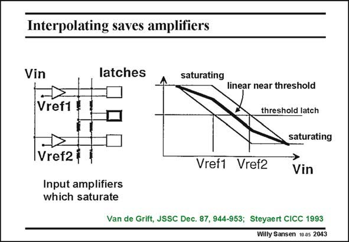

# SANSEN-2043 · Interpolating saves amplifiers

章节：20 CMOS 模数与数模转换原理  
PDF 页：614；书本页：625；幻灯片编号：2043  
状态：unreviewed



## 对应教材讲解

### PDF 613 · 书本 624

To further reduce the number of input comparators, interpolation and folding can be used. Interpolation is discussed first.

### PDF 614 · 书本 625

Interpolating converters use analog preprocessing. They have amplifiers at their inputs, which are linear near the threshold of the latches, but which saturate on both ends. In the linear region the gain is typically ten. The actual value is not that important as long as the crossover point is accurate. Low offset is important indeed. The transfer characteristic of the top amplifier crosses the latch threshold at voltage Vref1 because its second input is connected to Vref1. The latch now changes state at Vref1. This also applies to the bottom amplifier. Its transfer characteristic crosses the latch threshold at voltage Vref2 because its second input is connected to Vref2. The latch now changes state at Vref2. The outputs of the amplifiers are averaged out by four equal resistors. The transfer characteristic for the latch tin the middle will be the average of the two previous transfer characteristics. It is the bold line in the middle. It crosses the latch threshold at a voltage which is exactly halfway between Vref1 and Vref2. The latch in the middle thus changes state at this voltage halfway between Vref1 and Vref2. As a result, three latches are required and three levels are detected, but only two input amplifiers are needed. This is the result of interpolation.

## 公式／性能结论候选摘录

以下为规则截取的原文，尚未逐项判读。

- PDF 614: In the linear region the gain is typically ten.
- PDF 614: The outputs of the amplifiers are averaged out by four equal resistors.
- PDF 614: The latch in the middle thus changes state at this voltage halfway between Vref1 and Vref2.
- PDF 614: As a result, three latches are required and three levels are detected, but only two input amplifiers are needed.

## 曲线结论候选摘录

以下为规则截取的原文，尚未逐项判读。

- PDF 614: The transfer characteristic of the top amplifier crosses the latch threshold at voltage Vref1 because its second input is connected to Vref1.
- PDF 614: Its transfer characteristic crosses the latch threshold at voltage Vref2 because its second input is connected to Vref2.
- PDF 614: The transfer characteristic for the latch tin the middle will be the average of the two previous transfer characteristics.

## 原文条件与近似候选摘录

以下为规则截取的原文，尚未逐项判读。

- PDF 614: They have amplifiers at their inputs, which are linear near the threshold of the latches, but which saturate on both ends.

## 幻灯片 OCR（未校正）

```text
Interpolating saves amplifiers
Vin
latches
saturating
Vref1
Vref2
Input amplifiers
which saturate
Vref1
linear near threshold
threshold latch
saturating
Vref2
Vin
Van de Grift, JSSC Dec. 87, 944-953; Steyaert CICC 1993
Willy Sansen 10 gs 2043
```

数学上下标、分数及正负号以原图为准。电路图已保留；未核对的连接不输出成可仿真 netlist。
