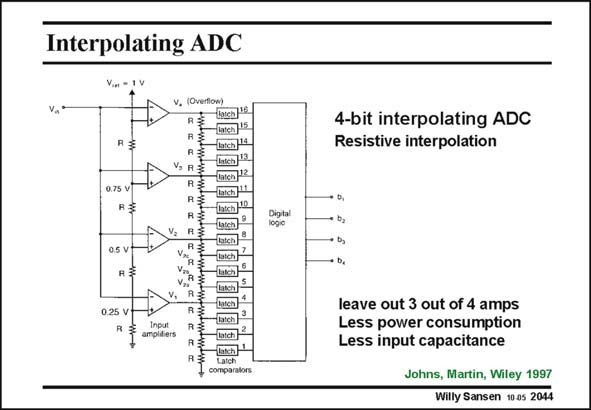

# SANSEN-2044 · Interpolating ADC

章节：20 CMOS 模数与数模转换原理  
PDF 页：614；书本页：625；幻灯片编号：2044  
状态：unreviewed



## 对应教材讲解

### PDF 614 · 书本 625

A more elaborate example is shown in this slide. Again, linear amplifier are used at the inputs, which saturate. Resistors are connected between the outputs of the amplifiers to create threshold voltages for the latches, which lie in between the reference voltages 0 V, 0.25 V, 0.5 V, 0.75 V and 1 V. Four resistors are inserted. As a result, three out of four amplifiers can be left out. This results in considerable savings in power consumption and especially input capacitance. The actual operation is discussed next.

## 公式／性能结论候选摘录

以下为规则截取的原文，尚未逐项判读。

- PDF 614: As a result, three out of four amplifiers can be left out.

## 曲线结论候选摘录

以下为规则截取的原文，尚未逐项判读。

（未由规则找到；不代表原页没有此类内容。）

## 原文条件与近似候选摘录

以下为规则截取的原文，尚未逐项判读。

- PDF 614: Again, linear amplifier are used at the inputs, which saturate.

## 幻灯片 OCR（未校正）

```text
Interpolating ADC
v. *
0.75 V
0.5 V
025 V
amolifiers
VUrerowy
Tch115
wwwwwwwww.wnsae
4-bit interpolating ADC
Resistive interpolation
leave out 3 out of 4 amps
Less power consumption
Less input capacitance
Johns, Martin, Wiley 1997
Willy Sansen 10 as 2044
```

数学上下标、分数及正负号以原图为准。电路图已保留；未核对的连接不输出成可仿真 netlist。
