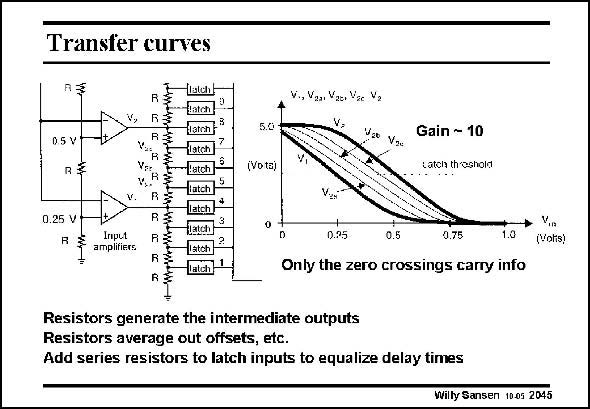

# SANSEN-2045 · Transfer curves

章节：20 CMOS 模数与数模转换原理  
PDF 页：615；书本页：626；幻灯片编号：2045  
状态：unreviewed



## 对应教材讲解

### PDF 615 · 书本 626

The bottom part of the converter of the previous slide is repeated, together with the transfer characteristics. The transfer characteristic of the bottom amplifier (voltage V ) crosses the 1 latch threshold at 0.25 V because its positive input is connected to 0.25 V. Latch 4 now changes state at 0.25 V. This also applies to the next amplifier with output V . Its transfer char- 2 acteristic crosses the latch threshold at 0.5 V because its positive input is connected to 0.5 V. Latch 8 therefore changes state at 0.5 V. The outputs of the amplifiers are averaged out by four equal resistors. The transfer characteristics for the latches 5, 6 and 7 are between V =0.25 V and V =0.5 V cross the latch threshold 1 2 at equal distances at voltages V =0.3125 V, V =0.375 V and V =0.4375 V. In this way three 2a 2b 2c more reference voltages are generated without the use of preamplifiers. At high frequencies, the latches which are directly connected to the preamplifiers such as latch 4, 8, ..., are driven at a lower impedance and are therefore faster. The ones in between such as 2, 6, ... have a larger series resistance at their input and are therefore slower. Series resistance has to be added to the inputs of latches 1, 3, 4, 5, 7, 8, to equalize the input delays.

## 公式／性能结论候选摘录

以下为规则截取的原文，尚未逐项判读。

- PDF 615: Latch 8 therefore changes state at 0.5 V.
- PDF 615: The outputs of the amplifiers are averaged out by four equal resistors.
- PDF 615: The transfer characteristics for the latches 5, 6 and 7 are between V =0.25 V and V =0.5 V cross the latch threshold 1 2 at equal distances at voltages V =0.3125 V, V =0.375 V and V =0.4375 V.
- PDF 615: At high frequencies, the latches which are directly connected to the preamplifiers such as latch 4, 8, ..., are driven at a lower impedance and are therefore faster.
- PDF 615: The ones in between such as 2, 6, ... have a larger series resistance at their input and are therefore slower.
- PDF 615: Series resistance has to be added to the inputs of latches 1, 3, 4, 5, 7, 8, to equalize the input delays.

## 曲线结论候选摘录

以下为规则截取的原文，尚未逐项判读。

- PDF 615: The bottom part of the converter of the previous slide is repeated, together with the transfer characteristics.
- PDF 615: The transfer characteristic of the bottom amplifier (voltage V ) crosses the 1 latch threshold at 0.25 V because its positive input is connected to 0.25 V.
- PDF 615: The transfer characteristics for the latches 5, 6 and 7 are between V =0.25 V and V =0.5 V cross the latch threshold 1 2 at equal distances at voltages V =0.3125 V, V =0.375 V and V =0.4375 V.

## 原文条件与近似候选摘录

以下为规则截取的原文，尚未逐项判读。

（未由规则找到；不代表原页没有此类内容。）

## 幻灯片 OCR（未校正）

```text
Transfer curves
V,
05V
Vnr
0.25 V
RE
Inpet
amplifiers.
R
R
wWrWW-ww.wrtWtWrr
V., Van Vabr Vac V2
5.0
Vgo Vge
(Vo ta)
Gain - 10
Latch threshold
D
0.95
0.5
0.75
Only the zero crossings carry info
(Vohs)
Resistors generate the intermediate outputs
Resistors average out offsets, etc.
Add series resistors to latch inputs to equalize delay times
Willy Sansen 10.05 2045
```

数学上下标、分数及正负号以原图为准。电路图已保留；未核对的连接不输出成可仿真 netlist。
