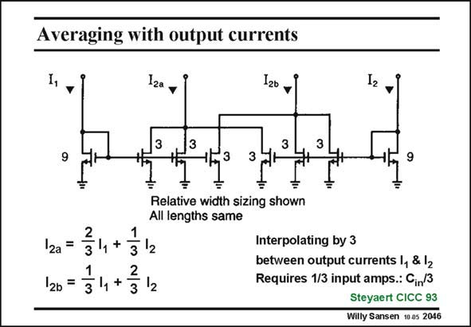

# SANSEN-2046 · Averaging with output currents

章节：20 CMOS 模数与数模转换原理  
PDF 页：615；书本页：626；幻灯片编号：2046  
状态：unreviewed



## 对应教材讲解

### PDF 615 · 书本 626

Averaging the output voltages of the preamplifiers was previously carried out with resistors, but can also be carried out with capacitors or with current sources. A simple example of averaging with current sources is shown in this slide. The output currents I 1 and I are interpolated by 2 three. Indeed, when the additional currents I and 2a I are generated (as given 2b in this slide), perfect interpolation is achieved. As a result, the number of input amplifiers is divided by three, and so is the input capacitance.

## 公式／性能结论候选摘录

以下为规则截取的原文，尚未逐项判读。

- PDF 615: As a result, the number of input amplifiers is divided by three, and so is the input capacitance.

## 曲线结论候选摘录

以下为规则截取的原文，尚未逐项判读。

（未由规则找到；不代表原页没有此类内容。）

## 原文条件与近似候选摘录

以下为规则截取的原文，尚未逐项判读。

（未由规则找到；不代表原页没有此类内容。）

## 幻灯片 OCR（未校正）

```text
Averaging with output currents
1,
12a
I26
12
3
13
3
3
9
2a*
2
31+•
312
26 =
34+ 312
3
9
=
=
Relative width sizing shown
All lengths same
=
Interpolating by 3
between output currents 1, & 12
Requires 1/3 input amps.: C;n/3
Steyaert CICC 93
Willy Sansen 10 gs 2046
```

数学上下标、分数及正负号以原图为准。电路图已保留；未核对的连接不输出成可仿真 netlist。
