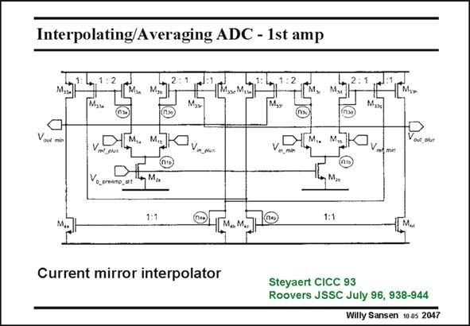

# SANSEN-2047 · Interpolating/Averaging ADC - 1st amp

章节：20 CMOS 模数与数模转换原理  
PDF 页：616；书本页：627；幻灯片编号：2047  
状态：unreviewed



## 对应教材讲解

### PDF 616 · 书本 627

A more elaborate example of interpolation by means of current sources is given in this slide. It is clear that the number of transistors connected at the node of each current mirror increases if the interpolation is increased. This reduces the speed at which such ADC can work, as shown next.

## 公式／性能结论候选摘录

以下为规则截取的原文，尚未逐项判读。

- PDF 616: It is clear that the number of transistors connected at the node of each current mirror increases if the interpolation is increased.

## 曲线结论候选摘录

以下为规则截取的原文，尚未逐项判读。

（未由规则找到；不代表原页没有此类内容。）

## 原文条件与近似候选摘录

以下为规则截取的原文，尚未逐项判读。

（未由规则找到；不代表原页没有此类内容。）

## 幻灯片 OCR（未校正）

```text
Interpolating/Averaging ADC - 1st amp
1:1
Current mirror interpolator
Steyaert CICC 93
Roovers JSSC July 96, 938-944
Willy Sansen 10 as 2047
```

数学上下标、分数及正负号以原图为准。电路图已保留；未核对的连接不输出成可仿真 netlist。
