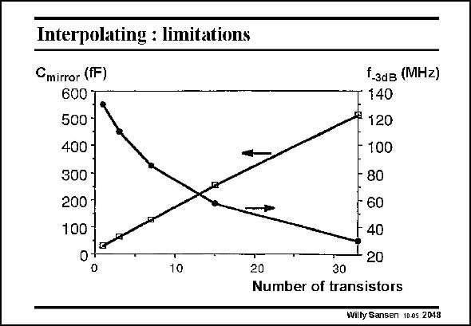

# SANSEN-2048 · Interpolating : limitations

章节：20 CMOS 模数与数模转换原理  
PDF 页：616；书本页：627；幻灯片编号：2048  
状态：unreviewed



## 对应教材讲解

### PDF 616 · 书本 627

More interpolation, to save more amplifiers and to further reduce the input capacitance, increases the capacitance C at the mirror inner node of the current mirrors. As a result, the maximum frequency at which the interpolation can be carried out decreases. An example is given in this slide of the node capacitance and resulting −3 dB frequency for an interpolator realized in 0.5 mm CMOS. A compromise is to be taken.

## 公式／性能结论候选摘录

以下为规则截取的原文，尚未逐项判读。

- PDF 616: More interpolation, to save more amplifiers and to further reduce the input capacitance, increases the capacitance C at the mirror inner node of the current mirrors.
- PDF 616: As a result, the maximum frequency at which the interpolation can be carried out decreases.

## 曲线结论候选摘录

以下为规则截取的原文，尚未逐项判读。

（未由规则找到；不代表原页没有此类内容。）

## 原文条件与近似候选摘录

以下为规则截取的原文，尚未逐项判读。

（未由规则找到；不代表原页没有此类内容。）

## 幻灯片 OCR（未校正）

```text
Interpolating : limitations
Cmirror (fF)
600
500
400 -
300-
200
100
0
f-зав (MHZ)
• 140
# 120
100
- 80
60
40
20
20
30
Number of transistors
Willy Sansen 10.05 2048
```

数学上下标、分数及正负号以原图为准。电路图已保留；未核对的连接不输出成可仿真 netlist。
