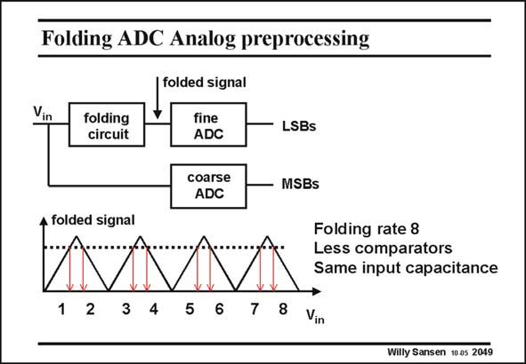

# SANSEN-2049 · Folding ADC Analog preprocessing

章节：20 CMOS 模数与数模转换原理  
PDF 页：617；书本页：628；幻灯片编号：2049  
状态：unreviewed



## 对应教材讲解

### PDF 616 · 书本 627

Interpolation allows to reduce the number of preamplifiers and the input capacitance, the number of latches being the same, however. Folding can be used to reduce the number of latches. Most often interpolation is used in combination with folding to reduce both preamplifiers and latches, which leads to a more drastic reduction in power consumption. The principle of folding is illustrated in this slide. Again, a preamplifier is used, but a different one, however. It folds the input signal in a number of voltage or folding regions. In this example, there are eight folding regions. The folding rate is

### PDF 617 · 书本 628

therefore eight. The output voltage of the folding circuit is the same for eight different values of the input voltage vin. A separate MSB ADC is required to discover in which of the eight folding regions the input voltage v in is actually present. This is a 3-bit ADC in this example. The LSBs are the determined by a fine ADC, which is the same for all eight folding regions. The number of comparators is used drastically. We will see later that the folding circuit is made up of as many differential pairs as the folding rate indicates. The input capacitance is not decreased! This is why interpolation is usually added, to reduce the input capacitance. A more detailed example of a 4-bit folding ADC is given next.

## 公式／性能结论候选摘录

以下为规则截取的原文，尚未逐项判读。

- PDF 617: therefore eight.
- PDF 617: The input capacitance is not decreased!

## 曲线结论候选摘录

以下为规则截取的原文，尚未逐项判读。

（未由规则找到；不代表原页没有此类内容。）

## 原文条件与近似候选摘录

以下为规则截取的原文，尚未逐项判读。

（未由规则找到；不代表原页没有此类内容。）

## 幻灯片 OCR（未校正）

```text
Folding ADC Analog preprocessing
Vin
folded signal
folding
circuit
fine
ADC
coarse
ADC
LSBS
A folded signal
1
2
3
4
5 6
7
8
MSBs
Folding rate 8
Less comparators
Same input capacitance
Vin
Willy Sansen 10 0s 2049
```

数学上下标、分数及正负号以原图为准。电路图已保留；未核对的连接不输出成可仿真 netlist。
