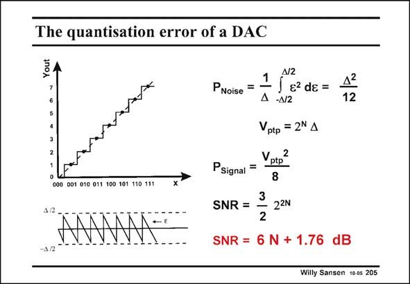

# SANSEN-205 · The quantisation error of a DAC

章节：20 CMOS 模数与数模转换原理  
PDF 页：594；书本页：605；幻灯片编号：205  
状态：unreviewed



## 对应教材讲解

### PDF 594 · 书本 605

The difference between the actual input voltage and the quantized voltage is a signal e, which has the shape of a sawtooth with peak-to-peak amplitude D. Its RMS value can be easily calculated to be D2/12. It is called quantization noise, because it is small. It is obvious that the quantization noise is smaller if the resolution N is larger. The Signal-to-noise ratio SNR can then easily be calculated to be 3/2 times 22N. Obviously, the larger the resolution, the larger the SNR. A rule of thumb is that for a resolution N, the SNR is about 6N+2. For a resolution of (N=) 8 bit, the SNR is about 50 dB. The SNR increases by 6 dB for each extra bit.

## 公式／性能结论候选摘录

以下为规则截取的原文，尚未逐项判读。

- PDF 594: The SNR increases by 6 dB for each extra bit.

## 曲线结论候选摘录

以下为规则截取的原文，尚未逐项判读。

- PDF 594: The difference between the actual input voltage and the quantized voltage is a signal e, which has the shape of a sawtooth with peak-to-peak amplitude D.

## 原文条件与近似候选摘录

以下为规则截取的原文，尚未逐项判读。

（未由规则找到；不代表原页没有此类内容。）

## 幻灯片 OCR（未校正）

```text
The quantisation error of a DAC
Yout
000 001 010 011 100 101 110 111
A/2
AMM•
N2
1
PNoise
=
s?dg =
Д -N12
12
Vptp = 2N A
P Signal
=
Vptp
8
SNR =
3
2
22N
SNR = 6 N + 1.76 dB
Willy Sansen 10 05 205
```

数学上下标、分数及正负号以原图为准。电路图已保留；未核对的连接不输出成可仿真 netlist。
