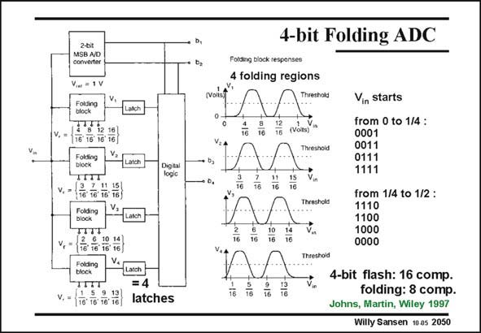

# SANSEN-2050 · 4-bit Folding ADC Fotding block converter

章节：20 CMOS 模数与数模转换原理  
PDF 页：617；书本页：628；幻灯片编号：2050  
状态：unreviewed



## 对应教材讲解

### PDF 617 · 书本 628

In this example there are 4 folding regions. A 2-bit MSB ADC is thus required to indicate in which folding region is the input voltage V . in Four folding circuits (blocks) are required, each followed by a latch. Only four latches are thus required, rather than 16 for a 4-bit flash ADC. The folding transfer characteristic is given for each folding circuit, giving output voltages V , V , V and V . 1 2 3 3 They all look similar; they are merely shifted over V /4. in The 2 LSBs are obtained as follows. If the input voltage V starts increasing from zero, voltage in V is the first one to cause a change of state (at 1/16 V), changing the output of its latch to go 4 from 0000 to 0001. At 2/16 V, also V causes a change of stage, changing 0001 into 0011. In this 3 way, a thermometer code is generated until 1111 is obtained, at the end of the first folding region. When V increases further beyond 4/16 V, voltage V is the first one to cause a change of in 4 state (at 5/16 V), changing the output of its latch to go from 1111 to 1110. At 6/16 V, also V 3 causes a change of stage, changing 1110 into 1100. As a result, a thermometer code is generated, but in reverse order.

### PDF 618 · 书本 629

When V increases beyond 9/16 V, the same code is generated as when it crossed 1/16 V, in i.e. 0001 and so on. The same LSBs are thus generated.

## 公式／性能结论候选摘录

以下为规则截取的原文，尚未逐项判读。

- PDF 617: A 2-bit MSB ADC is thus required to indicate in which folding region is the input voltage V . in Four folding circuits (blocks) are required, each followed by a latch.
- PDF 617: Only four latches are thus required, rather than 16 for a 4-bit flash ADC.
- PDF 617: When V increases further beyond 4/16 V, voltage V is the first one to cause a change of in 4 state (at 5/16 V), changing the output of its latch to go from 1111 to 1110.
- PDF 617: As a result, a thermometer code is generated, but in reverse order.
- PDF 618: When V increases beyond 9/16 V, the same code is generated as when it crossed 1/16 V, in i.e. 0001 and so on.
- PDF 618: The same LSBs are thus generated.

## 曲线结论候选摘录

以下为规则截取的原文，尚未逐项判读。

- PDF 617: The folding transfer characteristic is given for each folding circuit, giving output voltages V , V , V and V . 1 2 3 3 They all look similar; they are merely shifted over V /4. in The 2 LSBs are obtained as follows.

## 原文条件与近似候选摘录

以下为规则截取的原文，尚未逐项判读。

（未由规则找到；不代表原页没有此类内容。）

## 幻灯片 OCR（未校正）

```text
2-bit
MSB A/D
converter
Vie = 1 V
1 8 12 16
1, = 16 16 16' 16
rokain
TTT
v.-* 61%)
Foiding
V,
TITT
v, - (7 % 10 1)
rolding
block
V. = 176 18: 18: 16
Latch
Dig tai
logic
=4
latches
4-bit Folding ADC
(VoNst
Fotding block
4 folding regions
Threshold
16
12
16
(Vots)
16
16
16
Vea
16
älu
10
16
2
16
I2
16
Vin starts
from 0 to 1/4 :
0001
0011
0111
1111
from 1/4 to 1/2 :
1110
1100
1000
0000
4-bit flash: 16 comp.
folding: 8 comp.
Johns, Martin, Wiley 1997
Willy Sansen 10 as 2050
```

数学上下标、分数及正负号以原图为准。电路图已保留；未核对的连接不输出成可仿真 netlist。
