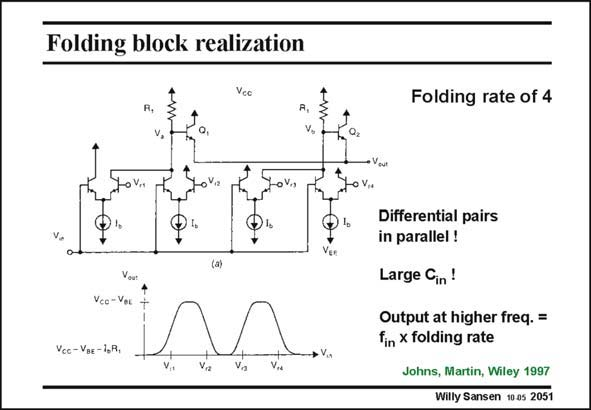

# SANSEN-2051 · Folding block realization

章节：20 CMOS 模数与数模转换原理  
PDF 页：618；书本页：629；幻灯片编号：2051  
状态：unreviewed



## 对应教材讲解

### PDF 618 · 书本 629

Such a folding block is usually realized by means of a number of differential pairs in parallel, the outputs of some of which are also connected in parallel. An example of a folding block with folding rate 4 is shown in this slide in bipolar technology. All four differential pairs are connected in parallel at the input. The appropriate outputs are connected two by two. Four equidistant references are connected to the inputs. They set the inversion points of the transfer characteristics of the differential pairs and hence determine the four folding regions. Note that the input sees four differential pairs in parallel. This is why folding does not decrease the input capacitance. Each folding block has as many differential pairs in parallel as the folding rate indicates. The input capacitance is the same as for a flash ADC. Note also that the output frequency of a folding block is at a higher frequency than the input voltage. This establishes the maximum frequency of operation. Finally, the 2-bit MSB ADC is easily realized with a circuit similar to the one in this slide. As reference voltages 4/16 V, 8/16 V, 12/16 V and 16/16 V have to be taken. The two MSBs are available at the output of the second differential pair and at the V terminal in this slide. out

## 公式／性能结论候选摘录

以下为规则截取的原文，尚未逐项判读。

- PDF 618: This is why folding does not decrease the input capacitance.

## 曲线结论候选摘录

以下为规则截取的原文，尚未逐项判读。

- PDF 618: They set the inversion points of the transfer characteristics of the differential pairs and hence determine the four folding regions.

## 原文条件与近似候选摘录

以下为规则截取的原文，尚未逐项判读。

（未由规则找到；不代表原页没有此类内容。）

## 幻灯片 OCR（未校正）

```text
Folding block realization
Folding rate of 4
oV.,
Vcc - VBE -1,R,
Differential pairs
in parallel !
Large Cin!
Output at higher freq. =
fin x folding rate
Johns, Martin, Wiley 1997
Willy Sansen 10 as 2051
```

数学上下标、分数及正负号以原图为准。电路图已保留；未核对的连接不输出成可仿真 netlist。
