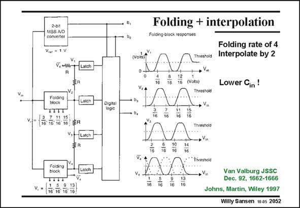

# SANSEN-2052 · Folding + interpolation converter

章节：20 CMOS 模数与数模转换原理  
PDF 页：618；书本页：629；幻灯片编号：2052  
状态：unreviewed



## 对应教材讲解

### PDF 618 · 书本 629

The only way to reduce the input capacitance is to involve interpolation. Application of interpolation by two to the previous 4-bit folding ADC yields the system shown in this slide. In this way, an 8-bit ADC has been realized for a 150 MHz input signal consuming only 0.8 W in bipolar technology (Van Valburg). Four folding blocks are used, each with a folding rate of eight. Interpolation is done each

### PDF 619 · 书本 630

time with four resistors. The zero crossings are now at 1/256 V intervals, with a 1 V reference voltage.

## 公式／性能结论候选摘录

以下为规则截取的原文，尚未逐项判读。

（未由规则找到；不代表原页没有此类内容。）

## 曲线结论候选摘录

以下为规则截取的原文，尚未逐项判读。

（未由规则找到；不代表原页没有此类内容。）

## 原文条件与近似候选摘录

以下为规则截取的原文，尚未逐项判读。

（未由规则找到；不代表原页没有此类内容。）

## 幻灯片 OCR（未校正）

```text
MSB A/D
converter
V...= 1V
V, ~w
TITT
11.15
V.=
Digtal
logic
Folding + interpolation
Folding rate of 4
weshold
Interpolate by 2
(VoRs)
Threshold
Lower Cin!
16
16
Van Valburg JSSC
Dec. 92, 1662-1666
Johns, Martin, Wiley 1997
Willy Sansen 10 as 2052
```

数学上下标、分数及正负号以原图为准。电路图已保留；未核对的连接不输出成可仿真 netlist。
