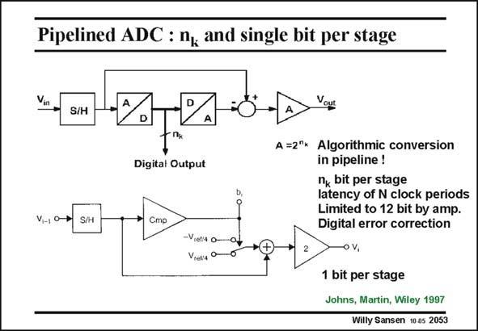

# SANSEN-2053 · Pipelined ADC : n, and single bit per stage

章节：20 CMOS 模数与数模转换原理  
PDF 页：619；书本页：630；幻灯片编号：2053  
状态：unreviewed



## 对应教材讲解

### PDF 619 · 书本 630

A pipelined converter is a pipeline of ADC stages, each providing n bits. One such k ADC stage is shown in this slide (on top). It is a similar algorithmic conversion as before. After a sample-and-hold operation, the input signal is converted into n bits. The k quantization error (or residue) is obtained after a DAC conversion, by taking the difference with the input signal itself. This difference is then multiplied by a factor of 2nk to be submitted to the next stage. A single-bit pipelined ADC converter is a converter with as many stages as bits, each stage doing a 1-bit conversion, starting with the MSB. Such a stage is shown in this slide (at the bottom). The ADC is now just a comparator. The DAC is merely a switch from the reference voltage. The amplifier has now a gain of two. It is clear that the weakness is the amplifier. This is why a single-bit pipelined ADC is preferred. It is fairly easy to realize an amplifier with a precise gain of two, as will be shown later. Nevertheless, the resolution is normally limited to about 12 bits. Digital correction allows the resolution to be expanded to 15 bits. In order to speed up the conversion, the first stage starts immediately converting the next sample, after completion of the first one. This applies to the other stages as well, as shown in the next slide.

## 公式／性能结论候选摘录

以下为规则截取的原文，尚未逐项判读。

- PDF 619: The amplifier has now a gain of two.
- PDF 619: It is fairly easy to realize an amplifier with a precise gain of two, as will be shown later.
- PDF 619: Nevertheless, the resolution is normally limited to about 12 bits.

## 曲线结论候选摘录

以下为规则截取的原文，尚未逐项判读。

（未由规则找到；不代表原页没有此类内容。）

## 原文条件与近似候选摘录

以下为规则截取的原文，尚未逐项判读。

（未由规则找到；不代表原页没有此类内容。）

## 幻灯片 OCR（未校正）

```text
Pipelined ADC : n, and single bit per stage
Vin
S/H
Digital Output
S/H
Стр
-Viets o-
Vrek'e o
Vour
A =2*x Algorithmic conversion
in pipeline!
n, bit per stage
latency of N clock periods
Limited to 12 bit by amp.
Digital error correction
o V,
1 bit per stage
Johns, Martin, Wiley 1997
Willy Sansen 10 as 2053
```

数学上下标、分数及正负号以原图为准。电路图已保留；未核对的连接不输出成可仿真 netlist。
