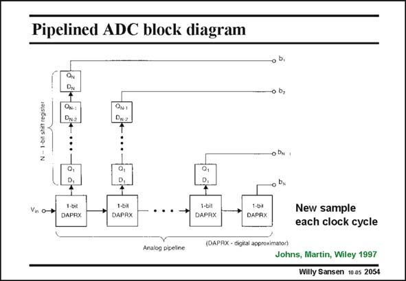

# SANSEN-2054 · Pipelined ADC block diagram

章节：20 CMOS 模数与数模转换原理  
PDF 页：620；书本页：631；幻灯片编号：2054  
状态：unreviewed



## 对应教材讲解

### PDF 619 · 书本 630

In this block diagram a converter stage, as shown in the previous slide, is called a Digital approximator DAPRX. It thus carries out the conversion, starting with a S/H and ending up with an amplifier. Each clock sample a new sample can be introduced to this ADC. It still takes N clock samples however to complete a conversion. The latency is thus N, but the processing rate is one sample per clock cycle.

### PDF 620 · 书本 631

They are used especially for low area and low power consumption, with limited resolution. Typical values are 12 bit up to 50 MS/s.

## 公式／性能结论候选摘录

以下为规则截取的原文，尚未逐项判读。

- PDF 619: It thus carries out the conversion, starting with a S/H and ending up with an amplifier.
- PDF 619: The latency is thus N, but the processing rate is one sample per clock cycle.
- PDF 620: They are used especially for low area and low power consumption, with limited resolution.

## 曲线结论候选摘录

以下为规则截取的原文，尚未逐项判读。

（未由规则找到；不代表原页没有此类内容。）

## 原文条件与近似候选摘录

以下为规则截取的原文，尚未逐项判读。

- PDF 619: In this block diagram a converter stage, as shown in the previous slide, is called a Digital approximator DAPRX.

## 幻灯片 OCR（未校正）

```text
Pipelined ADC block diagram
0 0,
Vin o
1-bk
DAPRX
1-l
DAPRX
1-bit
DAPAX
1-01
DAPRX
New sample
each clock cycle
(DAPAX - digital approximator)
Analog pipeline
Johns, Martin, Wiley 1997
Willy Sansen 10 as 2054
```

数学上下标、分数及正负号以原图为准。电路图已保留；未核对的连接不输出成可仿真 netlist。
