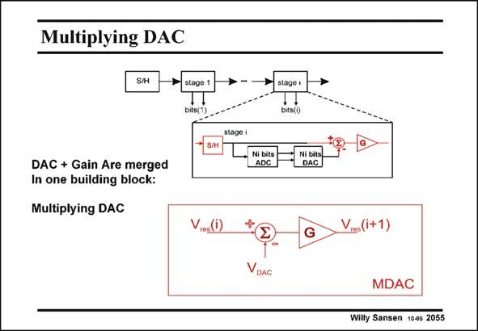

# SANSEN-2055 · Multiplying DAC

章节：20 CMOS 模数与数模转换原理  
PDF 页：620；书本页：631；幻灯片编号：2055  
状态：unreviewed



## 对应教材讲解

### PDF 620 · 书本 631

An efficient realization of the ADC/DAC and gain of two (for 1 bit per stage) can be carried out by use of a multiplying DAC. The output voltage of the DAC must be subtracted from the residue of the previous stage, after multiplication by two. All these functions can be easily integrated with highprecision in a switchedcapacitors circuit shown next.

## 公式／性能结论候选摘录

以下为规则截取的原文，尚未逐项判读。

- PDF 620: An efficient realization of the ADC/DAC and gain of two (for 1 bit per stage) can be carried out by use of a multiplying DAC.

## 曲线结论候选摘录

以下为规则截取的原文，尚未逐项判读。

（未由规则找到；不代表原页没有此类内容。）

## 原文条件与近似候选摘录

以下为规则截取的原文，尚未逐项判读。

（未由规则找到；不代表原页没有此类内容。）

## 幻灯片 OCR（未校正）

```text
Multiplying DAC
S/H
bits(1
DAC + Gain Are merged
In one building block:
Multiplying DAC
Vres(i)
bits("
Ni bits
ADC
Ni bits
DAC
VDAC
Vres(i+1)
MDAC
Willy Sansen 1005 2055
```

数学上下标、分数及正负号以原图为准。电路图已保留；未核对的连接不输出成可仿真 netlist。
