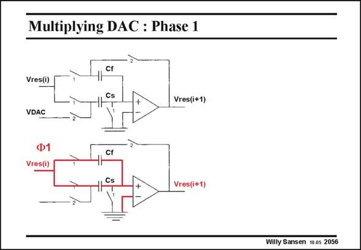

# SANSEN-2056 · Multiplying DAC : Phase 1

章节：20 CMOS 模数与数模转换原理  
PDF 页：621；书本页：632；幻灯片编号：2056  
状态：unreviewed



## 对应教材讲解

### PDF 621 · 书本 632

This circuit is shown twice, once for phase 1 (in red) and once for phase 2 (in blue). Two capacitors are used Cf and Cs and several switches, closing on phase 1 or on phase 2. When the phase 1 switches are closed, both capacitors are in parallel. They sample the input voltages Vres(i) which is the output of the previous stage.

## 公式／性能结论候选摘录

以下为规则截取的原文，尚未逐项判读。

（未由规则找到；不代表原页没有此类内容。）

## 曲线结论候选摘录

以下为规则截取的原文，尚未逐项判读。

- PDF 621: This circuit is shown twice, once for phase 1 (in red) and once for phase 2 (in blue).
- PDF 621: Two capacitors are used Cf and Cs and several switches, closing on phase 1 or on phase 2.
- PDF 621: When the phase 1 switches are closed, both capacitors are in parallel.

## 原文条件与近似候选摘录

以下为规则截取的原文，尚未逐项判读。

（未由规则找到；不代表原页没有此类内容。）

## 幻灯片 OCR（未校正）

```text
Multiplying DAC : Phase 1
Cf
Vres(i)
Cs
Vres(i+1)
VDAC
Cf
Vres(i)
Vres(i+
Willy Sansen 10 gs 2056
```

数学上下标、分数及正负号以原图为准。电路图已保留；未核对的连接不输出成可仿真 netlist。
