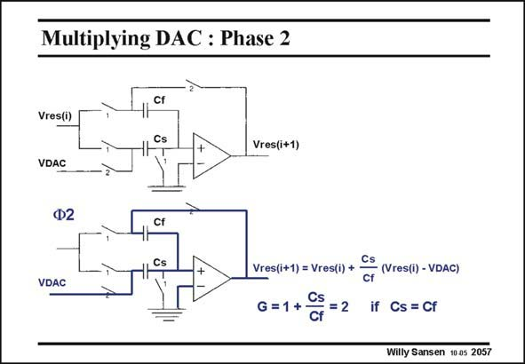

# SANSEN-2057 · Multiplying DAC : Phase 2

章节：20 CMOS 模数与数模转换原理  
PDF 页：621；书本页：632；幻灯片编号：2057  
状态：unreviewed



## 对应教材讲解

### PDF 621 · 书本 632

On phase 2, the capacitors are switched in as for an inverting amplifier with gain Cs/Cf. The output voltage Vres(i+1) will be the sum of the voltage initially stored on Cf, which is Vres(i), plus the result of the amplification by Cs/Cf, which is Cs/Cf times the voltage difference Vres(i)−VDAC. When both capacitors Cf and Cs are made equal, the gain is two. As a result, Vres(I) is multiplied by two and VDAC is subtracted. The precision can be quite high because matching two equal capacitors can be fairly easily achieved. For better matching they have to be made as large as possible. Some other factors limit the sizes of the capacitors however, as shown next.

## 公式／性能结论候选摘录

以下为规则截取的原文，尚未逐项判读。

- PDF 621: On phase 2, the capacitors are switched in as for an inverting amplifier with gain Cs/Cf.
- PDF 621: When both capacitors Cf and Cs are made equal, the gain is two.
- PDF 621: As a result, Vres(I) is multiplied by two and VDAC is subtracted.
- PDF 621: The precision can be quite high because matching two equal capacitors can be fairly easily achieved.
- PDF 621: Some other factors limit the sizes of the capacitors however, as shown next.

## 曲线结论候选摘录

以下为规则截取的原文，尚未逐项判读。

- PDF 621: On phase 2, the capacitors are switched in as for an inverting amplifier with gain Cs/Cf.

## 原文条件与近似候选摘录

以下为规则截取的原文，尚未逐项判读。

（未由规则找到；不代表原页没有此类内容。）

## 幻灯片 OCR（未校正）

```text
Multiplying DAC : Phase 2
Cf
Vres(i)
Vres(i+1)
VDAC
Ф2
VDAC
Vres(i+1) = Vres(i) + CS (Vres(i) - VDAC)
G=1+ G9 =2 if CS=GF
Willy Sansen 10 as 2057
```

数学上下标、分数及正负号以原图为准。电路图已保留；未核对的连接不输出成可仿真 netlist。
