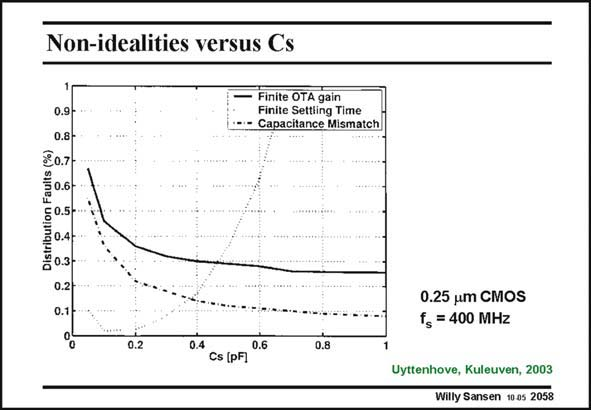

# SANSEN-2058 · Non-idealities versus Cs

章节：20 CMOS 模数与数模转换原理  
PDF 页：622；书本页：633；幻灯片编号：2058  
状态：unreviewed



## 对应教材讲解

### PDF 622 · 书本 633

The capacitors are better matched when they are made larger. Also the error as a result of finite gain improves somewhat. However, larger capacitors cause the settling time to increase. A compromise is necessary. This is illustrated for a high-speed pipelined converter in 0.25 mm CMOS technology. The sampling frequency is 400 MHz. The gain block has a transconductance of 20 mS. Capacitors of about 0.4 pF have been selected.

## 公式／性能结论候选摘录

以下为规则截取的原文，尚未逐项判读。

- PDF 622: Also the error as a result of finite gain improves somewhat.
- PDF 622: However, larger capacitors cause the settling time to increase.
- PDF 622: The gain block has a transconductance of 20 mS.

## 曲线结论候选摘录

以下为规则截取的原文，尚未逐项判读。

（未由规则找到；不代表原页没有此类内容。）

## 原文条件与近似候选摘录

以下为规则截取的原文，尚未逐项判读。

（未由规则找到；不代表原页没有此类内容。）

## 幻灯片 OCR（未校正）

```text
Non-idealities versus Cs
0.9
0.8-
₴o.7-
Finite OTA gain
Finite Settling Time
Capacitance Mismatch
50.5-
Distributi
0.4 -l
0.3
0.2-
0.1
0.25 um CMOS
fs = 400 MHz
0.2
0.4
0.6
Cs (pF]
0.8
Uyttenhove, Kuleuven, 2003
Willy Sansen 10 as 2058
```

数学上下标、分数及正负号以原图为准。电路图已保留；未核对的连接不输出成可仿真 netlist。
