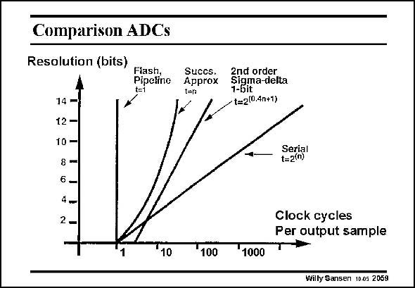

# SANSEN-2059 · Comparison ADCs

章节：20 CMOS 模数与数模转换原理  
PDF 页：622；书本页：633；幻灯片编号：2059  
状态：unreviewed



## 对应教材讲解

### PDF 622 · 书本 633

A good way of compareing ADCs is to check how many clock cycles are required to carry out the conversion. Power consumption is not considered here. It is clear that only two ADC’s need one single clock period. They are clearly the fastest ones. They are the flash converter and the pipeline converter. This is not quite true for the latter one as one byte is only available after one cycle in continuous operation. Moreover, their throughput is independent of the resolution. This is not true for the other, which all exhibit some relationship with the resolution. The worst one is a serial converter in which each voltage is converted into all bits before the next is started. The others are in between (i.e. successive approximation and sigma delta ones). Since they can be realized with very little power, they often offer the best compromise between speed and resolution.

## 公式／性能结论候选摘录

以下为规则截取的原文，尚未逐项判读。

- PDF 622: Moreover, their throughput is independent of the resolution.

## 曲线结论候选摘录

以下为规则截取的原文，尚未逐项判读。

（未由规则找到；不代表原页没有此类内容。）

## 原文条件与近似候选摘录

以下为规则截取的原文，尚未逐项判读。

- PDF 622: The others are in between (i.e. successive approximation and sigma delta ones).

## 幻灯片 OCR（未校正）

```text
Comparison ADCs
Resolution (bits)
Pipetino
14
12 -
10-
6-
4-
2
Succs.
Approx
t=n
1
100
1 Bna ieka
- t=2(0.4n+1)
Serial
t=2(n)
1000
Clock cycles
Per output sample
Willy Sansen 10.05 2059
```

数学上下标、分数及正负号以原图为准。电路图已保留；未核对的连接不输出成可仿真 netlist。
