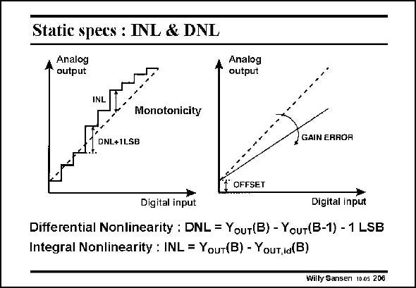

# SANSEN-206 · Static specs : INL & DNL

章节：20 CMOS 模数与数模转换原理  
PDF 页：594；书本页：605；幻灯片编号：206  
状态：unreviewed



## 对应教材讲解

### PDF 594 · 书本 605

The non-idealities of the DA conversion give rise to several specifications, such as the DNL and the INL. The DNL is the largest step ever minus one LSB. It is the largest deviation from a regular step. The INL is the largest deviation from the average slope. If this slope is not right, then a gain error is found. This slope must go through zero. If not, an offset occurs.

## 公式／性能结论候选摘录

以下为规则截取的原文，尚未逐项判读。

- PDF 594: If this slope is not right, then a gain error is found.

## 曲线结论候选摘录

以下为规则截取的原文，尚未逐项判读。

- PDF 594: The INL is the largest deviation from the average slope.
- PDF 594: If this slope is not right, then a gain error is found.
- PDF 594: This slope must go through zero.

## 原文条件与近似候选摘录

以下为规则截取的原文，尚未逐项判读。

（未由规则找到；不代表原页没有此类内容。）

## 幻灯片 OCR（未校正）

```text
Static specs : INL & DNL
Analog
autput
Analog
output
INL
Monotonicity
DNL+1LSB
GAIN ERROR
OFFSET
Digital input
Digital input
Differential Nonlinearity : DNL = YouT(B) - YouT(B-1) - 1 LSB
Integral Nonlinearity : INL = Youт(B) - Youт,ia(B)
Willy Sansen 10.05 206
```

数学上下标、分数及正负号以原图为准。电路图已保留；未核对的连接不输出成可仿真 netlist。
