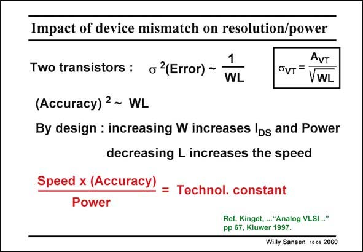

# SANSEN-2060 · Impact of device mismatch on resolution/power

章节：20 CMOS 模数与数模转换原理  
PDF 页：623；书本页：634；幻灯片编号：2060  
状态：unreviewed



## 对应教材讲解

### PDF 622 · 书本 633

Speed and resolution are actually linked to the power consumption. Their relation is even fixed for a certain CMOS technology.

### PDF 623 · 书本 634

If resolution is linked to the accuracy, as determined by matching, or the error, then we recall from Chapter 15 on offset, that this error is inversely proportional to the area WL of the MOST. On the other hand, the transistor width W is proportional to the current or the power consumption. Also the channel length L is inversely proportional to the speed. As a result, for a certain CMOS technology, the speed accuracy over power ratio is about constant. Before we calculate this constant, let us first of all, try to better understand what this means. If this is true, then the realization of an ADC at higher frequency always requires more power. Also, a higher resolution always requires more power.

## 公式／性能结论候选摘录

以下为规则截取的原文，尚未逐项判读。

- PDF 623: If resolution is linked to the accuracy, as determined by matching, or the error, then we recall from Chapter 15 on offset, that this error is inversely proportional to the area WL of the MOST.
- PDF 623: On the other hand, the transistor width W is proportional to the current or the power consumption.
- PDF 623: Also the channel length L is inversely proportional to the speed.
- PDF 623: As a result, for a certain CMOS technology, the speed accuracy over power ratio is about constant.

## 曲线结论候选摘录

以下为规则截取的原文，尚未逐项判读。

（未由规则找到；不代表原页没有此类内容。）

## 原文条件与近似候选摘录

以下为规则截取的原文，尚未逐项判读。

（未由规则找到；不代表原页没有此类内容。）

## 幻灯片 OCR（未校正）

```text
Impact of device mismatch on resolution/power
Two transistors : o 2(Error) ~
1
WL
AVT
OvT=
VWL
(Accuracy) 2 ~ WL
By design : increasing W increases Ids and Power
decreasing L increases the speed
Speed x (Accuracy)
= Technol. constant
Power
Ref. Kinget, ..."Analog VLSI .."
pp 67, Kluwer 1997.
Willy Sansen 10 0s 2060
```

数学上下标、分数及正负号以原图为准。电路图已保留；未核对的连接不输出成可仿真 netlist。
