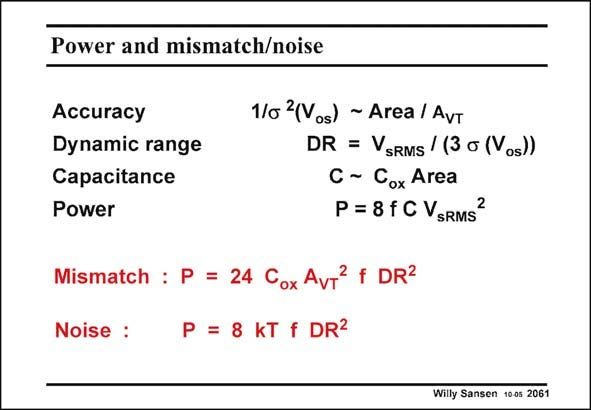

# SANSEN-2061 · Power and mismatch/noise

章节：20 CMOS 模数与数模转换原理  
PDF 页：623；书本页：634；幻灯片编号：2061  
状态：unreviewed



## 对应教材讲解

### PDF 623 · 书本 634

Let us try to find the value of this constant so that real numbers can be used to predict this relation between resolution, speed and power. If we take mismatch in threshold voltage as the main culprit for the lack of accuracy, the A gives the VT relation between error and area WL (see Chapter 15). As a dynamic range, the ratio is taken of the powers of the signal and this error is due to mismatch. The power consumption depends on the speed and the capacitances to be charges. This latter capacitance depends on area as well. Finally, the power consumption can be written in terms of all preceding parameters. It is plotted in the next slide. Before we investigage, however, this exercise is repeated for noise as an error rather than mismatch. The resulting expression is given as well. Both are now plotted.

## 公式／性能结论候选摘录

以下为规则截取的原文，尚未逐项判读。

- PDF 623: The power consumption depends on the speed and the capacitances to be charges.
- PDF 623: This latter capacitance depends on area as well.

## 曲线结论候选摘录

以下为规则截取的原文，尚未逐项判读。

- PDF 623: It is plotted in the next slide.
- PDF 623: Both are now plotted.

## 原文条件与近似候选摘录

以下为规则截取的原文，尚未逐项判读。

（未由规则找到；不代表原页没有此类内容。）

## 幻灯片 OCR（未校正）

```text
Power and mismatch/noise
Accuracy
Dynamic range
Capacitance
Power
1/o 2(Vos) ~ Area / AvT
DR =sRMS / (3 o (os))
C - Cox Area
P = 8fC VsRMS
Mismatch : P = 24 Cox AvT f DR2
Noise :
P = 8 kT f DR2
Willy Sansen 1005 2061
```

数学上下标、分数及正负号以原图为准。电路图已保留；未核对的连接不输出成可仿真 netlist。
