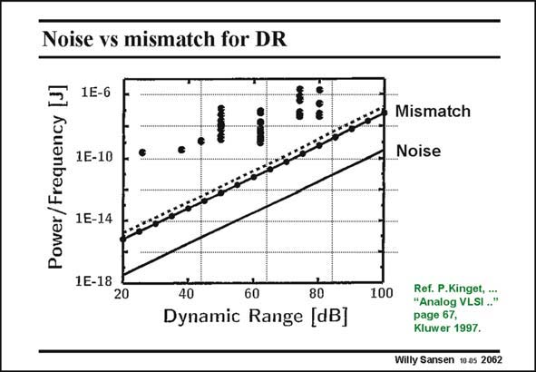

# SANSEN-2062 · Noise vs mismatch for DR

章节：20 CMOS 模数与数模转换原理  
PDF 页：624；书本页：635；幻灯片编号：2062  
状态：unreviewed



## 对应教材讲解

### PDF 624 · 书本 635

The power consumption is plotted for an ADC for a certain input signal frequency, versus dynamic range. The bottom line is the one for noise as a source of error. The other ones are for mismatch, for two different technologies 0.7 and 0.5 mm CMOS. All the dots on top correspond with ADCs published in the JSSC. It is clear that these firstorder estimates of the power for a certain dynamic range and frequency, are still far away for most realizations. It is also clear however, that mismatch line is a lot closer to the realizations than the noise curve. This means that mismatch as a source of error is a more realistic approximation of what can be achieved other than the noise. Also, these curves allow to estimate beforehand what power consumption is to be expected whenever an ADC is to be realized with a certain resolution and speed.

## 公式／性能结论候选摘录

以下为规则截取的原文，尚未逐项判读。

（未由规则找到；不代表原页没有此类内容。）

## 曲线结论候选摘录

以下为规则截取的原文，尚未逐项判读。

- PDF 624: The power consumption is plotted for an ADC for a certain input signal frequency, versus dynamic range.
- PDF 624: It is also clear however, that mismatch line is a lot closer to the realizations than the noise curve.
- PDF 624: Also, these curves allow to estimate beforehand what power consumption is to be expected whenever an ADC is to be realized with a certain resolution and speed.

## 原文条件与近似候选摘录

以下为规则截取的原文，尚未逐项判读。

- PDF 624: This means that mismatch as a source of error is a more realistic approximation of what can be achieved other than the noise.

## 幻灯片 OCR（未校正）

```text
Noise vs mismatch for DR
1E-6
Power / Frequency
1E-10
Mismatch
Noise
1E-14
1E-18
20
8-
80
Dynamic Range [dBJ
100
Ref. P.Kinget, ...
"Analog VLSI .."
page 67,
Kluwer 1997.
Willy Sansen 10 as 2062
```

数学上下标、分数及正负号以原图为准。电路图已保留；未核对的连接不输出成可仿真 netlist。
