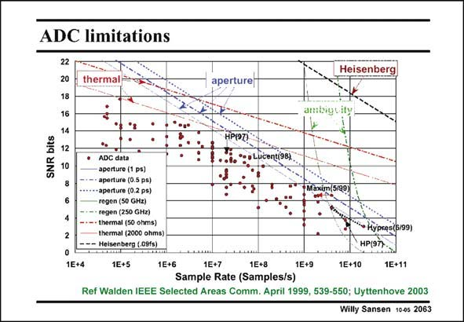

# SANSEN-2063 · ADC limitations

章节：20 CMOS 模数与数模转换原理  
PDF 页：624；书本页：635；幻灯片编号：2063  
状态：unreviewed



## 对应教材讲解

### PDF 624 · 书本 635

Another way to see how physical limitations come in trying to beat the powerresolution-speed barrier, a more general plot is shown in this slide. It shows that at low frequencies, thermal noise establishes a limit to what SNR can be obtained (red). The lower curve of the two is for a resistance of 2 kV. At higher frequencies however, aperture uncertainty of the sampling comes in (blue). This is mainly jitter of the clocks. The lower curve of the three is for a jitter of 1 ps. At really high frequencies other ambiguities show up (green). They have to do with the uncertainty of the regenerative switching of the comparator. The left curve is for a 50 GHz clock. At the highest frequencies Heisenberg comes in (black). This is still far out, however. All the realizations (red dots) are still fairly far away from these physical limits. Remember however that between the noise curve and the dots, a mismatch curve has to be added.

## 公式／性能结论候选摘录

以下为规则截取的原文，尚未逐项判读。

- PDF 624: Another way to see how physical limitations come in trying to beat the powerresolution-speed barrier, a more general plot is shown in this slide.
- PDF 624: It shows that at low frequencies, thermal noise establishes a limit to what SNR can be obtained (red).
- PDF 624: All the realizations (red dots) are still fairly far away from these physical limits.

## 曲线结论候选摘录

以下为规则截取的原文，尚未逐项判读。

- PDF 624: Another way to see how physical limitations come in trying to beat the powerresolution-speed barrier, a more general plot is shown in this slide.
- PDF 624: The lower curve of the two is for a resistance of 2 kV.
- PDF 624: The lower curve of the three is for a jitter of 1 ps.
- PDF 624: The left curve is for a 50 GHz clock.
- PDF 624: Remember however that between the noise curve and the dots, a mismatch curve has to be added.

## 原文条件与近似候选摘录

以下为规则截取的原文，尚未逐项判读。

（未由规则找到；不代表原页没有此类内容。）

## 幻灯片 OCR（未校正）

```text
ADC limitations
22
20
thermal=
18
16
bits
SNR
14
12
10
8
Heisenberg
aperturei
ambiguity
HP(97)
1E+4
ADC data
sperture (1 ps)
aperture (0.5 ps)
•aperture (0.2 ps)
regen (50 GHz)
regen (250 GHz)
• thermal (50 ohms)
thermal (2000 ohms)
- -- Heisenberg (.09fs) |
1E+5
Lucent(98)
Maxim159)
-Hуpкes(6/99)
HP(97)
1E+6
1E+7
1E+8
1E+9
1E+10
1E+11
Sample Rate (Samples/s)
Ref Walden IEEE Selected Areas Comm. April 1999, 539-550; Uyttenhove 2003
Willy Sansen 10-05 2063
```

数学上下标、分数及正负号以原图为准。电路图已保留；未核对的连接不输出成可仿真 netlist。
