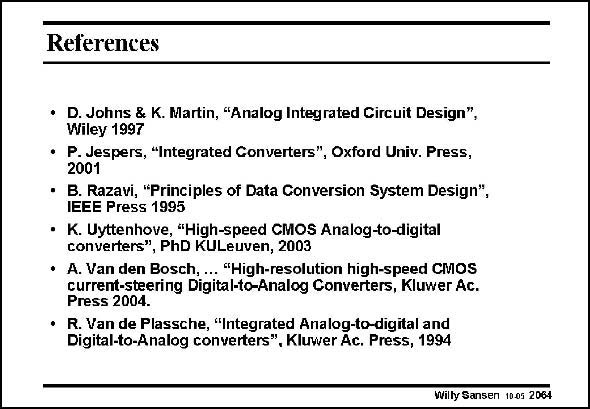

# SANSEN-2064 · References

章节：20 CMOS 模数与数模转换原理  
PDF 页：625；书本页：636；幻灯片编号：2064  
状态：unreviewed



## 对应教材讲解

### PDF 625 · 书本 636

Above are the references given which have been used throughout this Chapter. Many figures have been used from the first reference. All of them have contributed to this Chapter however, in one sense or another. The most general introduction is given by the last reference.

## 公式／性能结论候选摘录

以下为规则截取的原文，尚未逐项判读。

（未由规则找到；不代表原页没有此类内容。）

## 曲线结论候选摘录

以下为规则截取的原文，尚未逐项判读。

（未由规则找到；不代表原页没有此类内容。）

## 原文条件与近似候选摘录

以下为规则截取的原文，尚未逐项判读。

（未由规则找到；不代表原页没有此类内容。）

## 幻灯片 OCR（未校正）

```text
References
• D. Johns & K. Martin, "Analog Integrated Circuit Design",
Wiley 1997
• P. Jespers, "Integrated Converters", Oxford Univ. Press,
2001
• B. Razavi, "Principles of Data Gonversion System Design",
IEEE Press 1995
• K. Uyttenhove, "High-speed CMOS Analog-to-digital
converters", PhD KULeuven, 2003
• A. Van den Bosch, ... "High-resolution high-speed CMOS
current-steering Digital-to-Analog Converters, Kluwer Ac.
Press 2004.
• R. Van de Plassche, "Integrated Analog-to-digital and
Digital-to-Analog converters". Kluwer Ac. Press, 1994
Willy Sansen 1005 2064
```

数学上下标、分数及正负号以原图为准。电路图已保留；未核对的连接不输出成可仿真 netlist。
