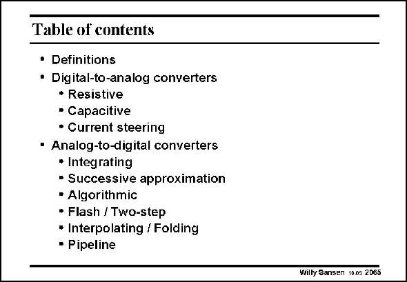

# SANSEN-2065 · Table of contents

章节：20 CMOS 模数与数模转换原理  
PDF 页：625；书本页：636；幻灯片编号：2065  
状态：unreviewed



## 对应教材讲解

### PDF 625 · 书本 636

This Chapter has given an overview of the different types of DAC’s and Nyquist ADCs. The operating principles have mainly been discussed. Some of the major compromises have been introduced. Oversampling ADCs are discussed next. The focus is on low-power realizations.

## 公式／性能结论候选摘录

以下为规则截取的原文，尚未逐项判读。

（未由规则找到；不代表原页没有此类内容。）

## 曲线结论候选摘录

以下为规则截取的原文，尚未逐项判读。

（未由规则找到；不代表原页没有此类内容。）

## 原文条件与近似候选摘录

以下为规则截取的原文，尚未逐项判读。

（未由规则找到；不代表原页没有此类内容。）

## 幻灯片 OCR（未校正）

```text
Table of contents
• Definitions
• Digital-to-analog converters
• Resistive
• Capacitive
• Current steering
• Analog-to-digital converters
• Integrating
• Successive approximation
• Algorithmic
• Flash / Two-step
• Interpolating / Folding
• Pipeline
Willy Sansen 1005 2065
```

数学上下标、分数及正负号以原图为准。电路图已保留；未核对的连接不输出成可仿真 netlist。
