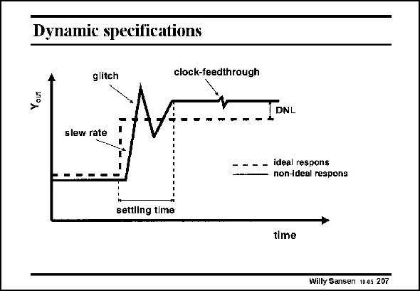

# SANSEN-207 · Dynamie specifications

章节：20 CMOS 模数与数模转换原理  
PDF 页：595；书本页：606；幻灯片编号：207  
状态：unreviewed



## 对应教材讲解

### PDF 595 · 书本 606

When the output voltage changes in time, as a result of change of bit b, then the transition may not be instantaneous. The change in voltage may experience a limited rise time, or slew rate. Moreover an overshoot may occur, called glitch. The energy in this glitch (which is the integral under this glitch waveform) must be smaller than the energy of a LSB. The time required to reach the final value (within 0.1% for example) is called the settling time. As clocks are used, some clock feedthrough may occur as well.

## 公式／性能结论候选摘录

以下为规则截取的原文，尚未逐项判读。

- PDF 595: When the output voltage changes in time, as a result of change of bit b, then the transition may not be instantaneous.
- PDF 595: The change in voltage may experience a limited rise time, or slew rate.

## 曲线结论候选摘录

以下为规则截取的原文，尚未逐项判读。

（未由规则找到；不代表原页没有此类内容。）

## 原文条件与近似候选摘录

以下为规则截取的原文，尚未逐项判读。

（未由规则找到；不代表原页没有此类内容。）

## 幻灯片 OCR（未校正）

```text
Dynamie specifications
glitch
clock-feedthrough
Yout
DNL
slew rate
Ideal respons
non-ideal respons
settling time
time
Willy Sansen 10.05 207
```

数学上下标、分数及正负号以原图为准。电路图已保留；未核对的连接不输出成可仿真 netlist。
