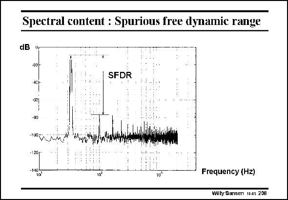

# SANSEN-208 · Spectral content : Spurious free dynamic range

章节：20 CMOS 模数与数模转换原理  
PDF 页：595；书本页：606；幻灯片编号：208  
状态：unreviewed



## 对应教材讲解

### PDF 595 · 书本 606

In the frequency domain, the analog output voltage of a DAC may contain various harmonics. The ratio of the output, fundamental to the largest harmonic is called the SFDR. This is usually the second harmonic. For fullydifferential systems however, this is most probably the third harmonic.

## 公式／性能结论候选摘录

以下为规则截取的原文，尚未逐项判读。

（未由规则找到；不代表原页没有此类内容。）

## 曲线结论候选摘录

以下为规则截取的原文，尚未逐项判读。

（未由规则找到；不代表原页没有此类内容。）

## 原文条件与近似候选摘录

以下为规则截取的原文，尚未逐项判读。

（未由规则找到；不代表原页没有此类内容。）

## 幻灯片 OCR（未校正）

```text
Spectral content : Spurious free dynamic range
dB
-301
SFDR
•0D
-90
-100 -р
-120
-140
10'
Frequency (Hz)
Willy Sansen 10.05 208
```

数学上下标、分数及正负号以原图为准。电路图已保留；未核对的连接不输出成可仿真 netlist。
