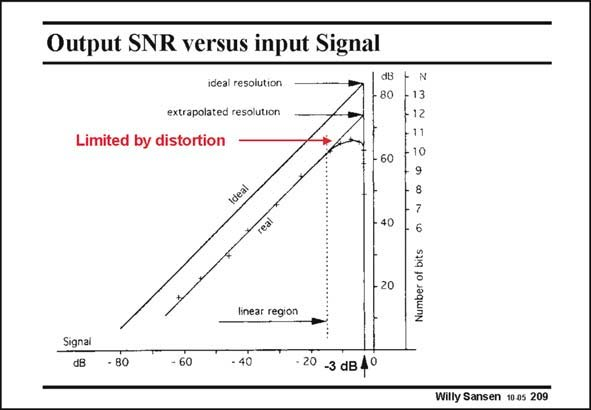

# SANSEN-209 · Output SNR versus input Signal

章节：20 CMOS 模数与数模转换原理  
PDF 页：596；书本页：607；幻灯片编号：209  
状态：unreviewed



## 对应教材讲解

### PDF 596 · 书本 607

For a certain resolution, the quantization (and other) noise is about constant. The SNR increases for increasing input voltage. The maximum SNR is reached for the largest possible input signal amplitude. This latter signal is normally limited by distortion. In the example in this slide the maximum SNR is theoretically 74 dB, corresponding to 12 bit. Because of distortion, only 66 dB is found however, corresponding to about 10.6 bit. The SNDR (Signal-to-noise-and-distortion ratio) is thus only 66 dB. The ideal values are always somewhat higher. As a rule of thumb about 1 bit is lost from theory to practice (measurement).

## 公式／性能结论候选摘录

以下为规则截取的原文，尚未逐项判读。

- PDF 596: The SNR increases for increasing input voltage.
- PDF 596: This latter signal is normally limited by distortion.
- PDF 596: The SNDR (Signal-to-noise-and-distortion ratio) is thus only 66 dB.

## 曲线结论候选摘录

以下为规则截取的原文，尚未逐项判读。

（未由规则找到；不代表原页没有此类内容。）

## 原文条件与近似候选摘录

以下为规则截取的原文，尚未逐项判读。

（未由规则找到；不代表原页没有此类内容。）

## 幻灯片 OCR（未校正）

```text
Output SNR versus input Signal
ideal resolution
extrapolated resolution
Limited by distortion
db
• 80
- 60
N
13
+12
-11
10
9
8
• 40
- 20
Einear region
6
Number of bits
Signal
dB
- 80
- 60
- 40
• 20 -3 dB 4°
Willy Sansen 10 as 209
```

数学上下标、分数及正负号以原图为准。电路图已保留；未核对的连接不输出成可仿真 netlist。
