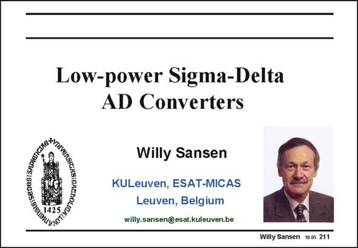

# SANSEN-211 · Slide 211

章节：21 低功耗 ΣΔ 模数转换器  
PDF 页：626；书本页：637；幻灯片编号：211  
状态：unreviewed



## 对应教材讲解

### PDF 626 · 书本 637

Low power consumption is not always a result of low supply voltages. The additional signal processing required to maintain the same or maybe an even better dynamic range despite the reduction in supply voltage, may cause additional power consumption. Good examples are sigma-delta (or delta-sigma) analog-to-digital converters. Their lowest supply voltage is 0.6 and even 0.5 V, which is largely sufficient to be embedded in 65 and even 45 nm CMOS. The problem in these converters is that they have to maintain the same dynamic range as their 1.8 V and higher counterparts. A low supply voltage always assumes that all circuit techniques are also applied to reduce the power consumption. This Chapter explains what circuit techniques are available to realize low power Delta-Sigma converters at very low supply voltages. Many of these circuit techniques will become important once nanometer CMOS have become mainstream.

## 公式／性能结论候选摘录

以下为规则截取的原文，尚未逐项判读。

（未由规则找到；不代表原页没有此类内容。）

## 曲线结论候选摘录

以下为规则截取的原文，尚未逐项判读。

（未由规则找到；不代表原页没有此类内容。）

## 原文条件与近似候选摘录

以下为规则截取的原文，尚未逐项判读。

- PDF 626: A low supply voltage always assumes that all circuit techniques are also applied to reduce the power consumption.

## 幻灯片 OCR（未校正）

```text
Low-power Sigma-Delta
AD Converters
Willy Sansen
KULeuven, ESAT-MICAS
Leuven, Belgium
willy.sansen@esat.kuleuven.be
Willy Sansen 10.05 211
```

数学上下标、分数及正负号以原图为准。电路图已保留；未核对的连接不输出成可仿真 netlist。
