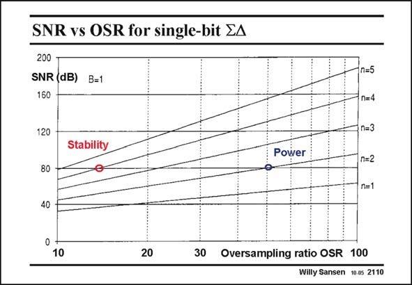

# SANSEN-2110 · SNR vs OSR for single-bit EA

章节：21 低功耗 ΣΔ 模数转换器  
PDF 页：631；书本页：642；幻灯片编号：2110  
状态：unreviewed



## 对应教材讲解

### PDF 631 · 书本 642

The values of the SNR which can be achieved depending on the values of the three design variables are given in this slide. However, for all of them single-bit quantization is taken. The SNR is given versus the OSR and for different orders of noise-shaping. The higher the OSR and the noise-shaping order, the higher the SNR. The same SNR can therefore be achieved for either higher OSR or for higher noise-shaping. For example, 80 dB SNR (corresponding to 13 bit resolution) can be realized by either an OSR of only 14 requiring 4th order noise shaping, or by an OSR of 50 allowing only 2nd order noise shaping. Which one is preferable? Fourth-order noise shaping may require a Mash topology, which requires tougher matching conditions. High OSR values on the other hand, require higher-speed opamps which require more power consumption. This is the trade-off. For high-speed Sigma-Delta converters low values of OSR’s are preferred, leading to stability and matching considerations. For low-power Sigma-Delta converters, low values of OSR’s are also preferred, leading to similar considerations.

## 公式／性能结论候选摘录

以下为规则截取的原文，尚未逐项判读。

- PDF 631: The values of the SNR which can be achieved depending on the values of the three design variables are given in this slide.
- PDF 631: The same SNR can therefore be achieved for either higher OSR or for higher noise-shaping.

## 曲线结论候选摘录

以下为规则截取的原文，尚未逐项判读。

（未由规则找到；不代表原页没有此类内容。）

## 原文条件与近似候选摘录

以下为规则截取的原文，尚未逐项判读。

（未由规则找到；不代表原页没有此类内容。）

## 幻灯片 OCR（未校正）

```text
SNR vs OSR for single-bit EA
200
SNR (dB)
160
B=1
120
Stability
Power
80
n=5
n=4
n=3
n=2
n=1
40
0
10
20
30 Oversampling ratio OSR 100
Willy Sansen 10.05 2110
```

数学上下标、分数及正负号以原图为准。电路图已保留；未核对的连接不输出成可仿真 netlist。
