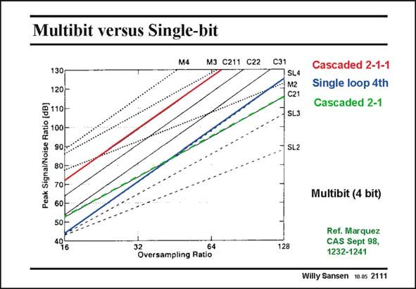

# SANSEN-2111 · Multibit versus Single-bit

章节：21 低功耗 ΣΔ 模数转换器  
PDF 页：631；书本页：642；幻灯片编号：2111  
状态：unreviewed



## 对应教材讲解

### PDF 631 · 书本 642

The use of more bits for the quantization also increases the maximum SNR. In this graph M stands for multibit; – M4 thus stands for 4 bit quantization, – C211 stands for 4th-order noise shaping with a 2–1–1 Mash or cascaded topology; note that a 2–2 Mash topology offers less SNR, – SL4 stand for a 4th-order single-loop topology. It is clear that a 4-bit 4thorder noise shaping is by far the best. It is also clear that 3rd-order noise shaping provides lower SNR values. This is true for both a 2–1 Mash topology (C21) and for a 3rd order single-loop topology (SL3).

### PDF 632 · 书本 643

From this it can be concluded that multibit Sigma-delta realizations offer the highest SNR values for low OSR values. If matching problems have to be avoided however, single-bit solutions are quite attractive provided 4th order noise shaping is used in a 2–1–1 Mash topology.

## 公式／性能结论候选摘录

以下为规则截取的原文，尚未逐项判读。

- PDF 631: The use of more bits for the quantization also increases the maximum SNR.
- PDF 631: In this graph M stands for multibit; – M4 thus stands for 4 bit quantization, – C211 stands for 4th-order noise shaping with a 2–1–1 Mash or cascaded topology; note that a 2–2 Mash topology offers less SNR, – SL4 stand for a 4th-order single-loop topology.

## 曲线结论候选摘录

以下为规则截取的原文，尚未逐项判读。

（未由规则找到；不代表原页没有此类内容。）

## 原文条件与近似候选摘录

以下为规则截取的原文，尚未逐项判读。

- PDF 632: If matching problems have to be avoided however, single-bit solutions are quite attractive provided 4th order noise shaping is used in a 2–1–1 Mash topology.

## 幻灯片 OCR（未校正）

```text
Multibit versus Single-bit
M4
M3 C211 C22
130
120-
E110-
Peak Signal/Noise Ratio
100
90
80
70
60
50 -
496
32
64
Oversampling Ratio
C31
SL4
M2
C21
SL3
Cascaded 2-1-1
Single loop 4th
Cascaded 2-1
SL2
Multibit (4 bit)
128
Ref. Marquez
CAS Sept 98,
1232-1241
Willy Sansen
10.05 2111
```

数学上下标、分数及正负号以原图为准。电路图已保留；未核对的连接不输出成可仿真 netlist。
