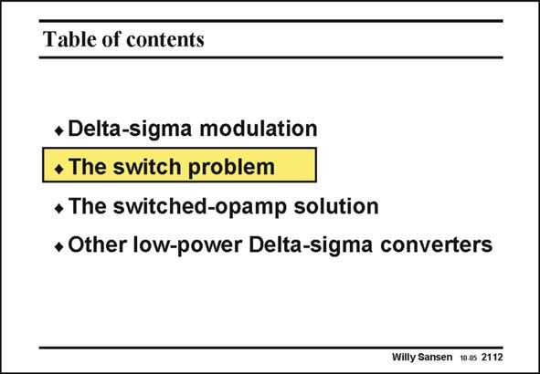

# SANSEN-2112 · Table of contents

章节：21 低功耗 ΣΔ 模数转换器  
PDF 页：632；书本页：643；幻灯片编号：2112  
状态：unreviewed



## 对应教材讲解

### PDF 632 · 书本 643

Now that we know which topology is most attractive, we have to focus on the implementation. Most noise-shaping filters are realized with switchedcapacitor techniques. However, for low supply voltages, the switches are difficult to realize. This is discussed next.

## 公式／性能结论候选摘录

以下为规则截取的原文，尚未逐项判读。

（未由规则找到；不代表原页没有此类内容。）

## 曲线结论候选摘录

以下为规则截取的原文，尚未逐项判读。

（未由规则找到；不代表原页没有此类内容。）

## 原文条件与近似候选摘录

以下为规则截取的原文，尚未逐项判读。

（未由规则找到；不代表原页没有此类内容。）

## 幻灯片 OCR（未校正）

```text
Table of contents
* Delta-sigma modulation
• The switch problem
• The switched-opamp solution
• Other low-power Delta-sigma converters
Willy Sansen 10.05 2112
```

数学上下标、分数及正负号以原图为准。电路图已保留；未核对的连接不输出成可仿真 netlist。
