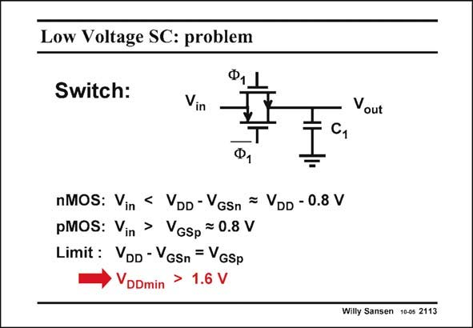

# SANSEN-2113 · Low Voltage SC: problem

章节：21 低功耗 ΣΔ 模数转换器  
PDF 页：632；书本页：643；幻灯片编号：2113  
状态：unreviewed



## 对应教材讲解

### PDF 632 · 书本 643

The supply voltage decreases for decreasing channel lengths. For 0.25 mm channel length, the supply voltage was 2.5 V; for 0.18 mm CMOS it was 1.8 V and so on. For 90 nm CMOS the supply voltage is about 1.2 V. Supply voltages will now be used below 1 V. With a 1 V supply voltage the MOST switch is difficult to turn on. Assume that a transmission gate is used as a switch, with a nMOST in parallel with a pMOST, as shown in this slide, The nMOST Gate is driven with a positive (supply) voltage to turn it on. The pMOST is at the same time driven with the most negative voltage or ground. For zero input voltage V , the Gate drive of the nMOST is the full supply voltage V , its in DD V also equals V . This is sufficient to provide a low ON-resistance. GSn DD Indeed, assume that the V is about 0.6 V and the minimum V −V for conduction is about T GS T 0.2 V, the minimum V is now about 0.8 V. As a result, the input voltage V can only increase GS in until it reaches V –0.8 V. For higher input voltages, the nMOST can no longer be turned on. DD

### PDF 633 · 书本 644

The same is true for the pMOST device. The input voltage V can only decrease until it in reaches 0.8 V. For lower input voltages, the pMOST can no longer be turned on. This establishes a minimum value for the supply voltage V which is the sum of both V DDmin GS values. In this example this is 1.6 V.

## 公式／性能结论候选摘录

以下为规则截取的原文，尚未逐项判读。

- PDF 632: The supply voltage decreases for decreasing channel lengths.
- PDF 632: For zero input voltage V , the Gate drive of the nMOST is the full supply voltage V , its in DD V also equals V .
- PDF 632: As a result, the input voltage V can only increase GS in until it reaches V –0.8 V.
- PDF 633: The input voltage V can only decrease until it in reaches 0.8 V.

## 曲线结论候选摘录

以下为规则截取的原文，尚未逐项判读。

（未由规则找到；不代表原页没有此类内容。）

## 原文条件与近似候选摘录

以下为规则截取的原文，尚未逐项判读。

- PDF 632: Assume that a transmission gate is used as a switch, with a nMOST in parallel with a pMOST, as shown in this slide, The nMOST Gate is driven with a positive (supply) voltage to turn it on.
- PDF 632: GSn DD Indeed, assume that the V is about 0.6 V and the minimum V −V for conduction is about T GS T 0.2 V, the minimum V is now about 0.8 V.

## 幻灯片 OCR（未校正）

```text
Low Voltage SC: problem
Switch:
Ф,
Vin
Vout
nMOS: Vin
, < DD-GSn = DD - 0.8 V
pMOS: Vin > VGsp =0.8 V
Limit : VDD - VGSn = VGSp
VDDmin
>
1.6 V
Willy Sansen 10-0s 2113
```

数学上下标、分数及正负号以原图为准。电路图已保留；未核对的连接不输出成可仿真 netlist。
