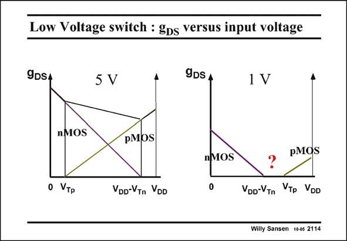

# SANSEN-2114 · Low Voltage switch : gDs versus input voltage

章节：21 低功耗 ΣΔ 模数转换器  
PDF 页：633；书本页：644；幻灯片编号：2114  
状态：unreviewed



## 对应教材讲解

### PDF 633 · 书本 644

The same story is given in this slide. The output conductance (inverse ON resistance) is given for input voltages from zero to the supply voltage V . DD In both cases, the nMOST conducts for low input voltages and the pMOST for high input voltages. For a large supply voltage (5 V), there is a large region in the middle where both the nMOST and pMOST conduct, giving rise to a small total ON- resistance. However, for a small supply voltage (1 V) there is a hole in the middle. None of the MOSTs can be turned on. For such a low supply voltage it is therefore not possible to construct a nMOST/pMOST switch combination which conducts for all input voltages. How can we solve this problem? Note that in the plots in this slide, the V ’s have been substituted by the V ’s themselves. In GS T this way, the lowest possible V ’s values have been taken into account. There may still be some GS leakage because of the weak-inversion operation but this has been neglected.

## 公式／性能结论候选摘录

以下为规则截取的原文，尚未逐项判读。

- PDF 633: For such a low supply voltage it is therefore not possible to construct a nMOST/pMOST switch combination which conducts for all input voltages.

## 曲线结论候选摘录

以下为规则截取的原文，尚未逐项判读。

- PDF 633: Note that in the plots in this slide, the V ’s have been substituted by the V ’s themselves.

## 原文条件与近似候选摘录

以下为规则截取的原文，尚未逐项判读。

- PDF 633: There may still be some GS leakage because of the weak-inversion operation but this has been neglected.

## 幻灯片 OCR（未校正）

```text
Low Voltage switch : gDs versus input voltage
9DSA
5 V
9DS A
1 V
nMOS
pMOS
o VTP
VDD-VTn VDD
nMOS
0
pMOS
?
VDo-VTn VTp VDD
Willy Sansen 10-0s 2114
```

数学上下标、分数及正负号以原图为准。电路图已保留；未核对的连接不输出成可仿真 netlist。
