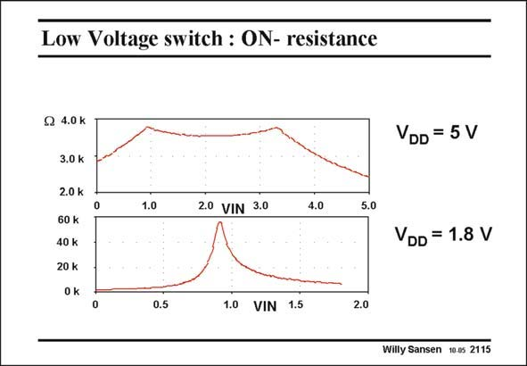

# SANSEN-2115 · Low Voltage switch : ON- resistance

章节：21 低功耗 ΣΔ 模数转换器  
PDF 页：633；书本页：644；幻灯片编号：2115  
状态：unreviewed



## 对应教材讲解

### PDF 633 · 书本 644

The same story is repeated once more but for the ON-resistances themselves. The numerical values of the ON-resistances are plotted for input voltages going from zero to the supply voltage V . DD The numerical values correspond to an older CMOS process with rather large V T values (0.9 V). The W/L ratios are five. It is clear that for a supply voltage of 5 V, there is a large region in the middle

### PDF 634 · 书本 645

where both transistors conduct. This region disappears when the supply voltage is lowered to a value which is roughly the sum of the two V ’s or 1.8 V in this example. T As a consequence, such a transmission gate with a nMOST/pMOST parallel combination cannot be used any longer for supply voltages below the sum of the V ’s. This is 1.8 V in this T example. For present days V ’s of T 0.35 V, this is about 0.7 V. This is lower than 1 V, but not significantly!

## 公式／性能结论候选摘录

以下为规则截取的原文，尚未逐项判读。

（未由规则找到；不代表原页没有此类内容。）

## 曲线结论候选摘录

以下为规则截取的原文，尚未逐项判读。

- PDF 633: The numerical values of the ON-resistances are plotted for input voltages going from zero to the supply voltage V .

## 原文条件与近似候选摘录

以下为规则截取的原文，尚未逐项判读。

（未由规则找到；不代表原页没有此类内容。）

## 幻灯片 OCR（未校正）

```text
Low Voltage switch : ON- resistance
Q 4.0 k
3.0 k
2.0 k
60 k
40 k
20 k
0 k
VDD = 5V
0
1.0
2.0 VIN 3.0
4.0
5.0
VDD = 1.8 V
o
0.5
1.0 VIN 1.5
2.0
Willy Sansen 10.0s 2115
```

数学上下标、分数及正负号以原图为准。电路图已保留；未核对的连接不输出成可仿真 netlist。
