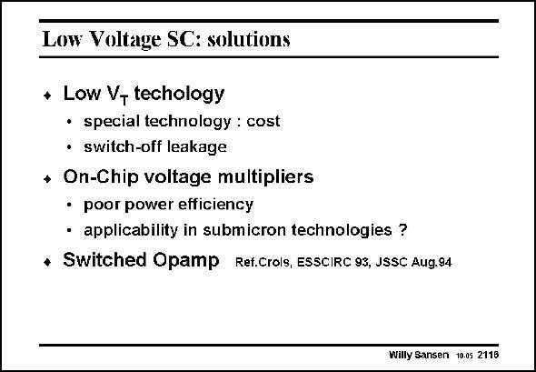

# SANSEN-2116 · Low Voltage SC: solutions

章节：21 低功耗 ΣΔ 模数转换器  
PDF 页：634；书本页：645；幻灯片编号：2116  
状态：unreviewed



## 对应教材讲解

### PDF 634 · 书本 645

What solutions are available for using switches at supply voltages below the sum of the threshold voltages? The first one is to ask for a modification in technology. Normally the V ’s are T determined for optimum performance of the digital part. This means that nowadays two different oxide thickness are often available. The thinner ones offer lower V ’s and higher T speeds. The thicker ones provide larger values of V T and lower leakage currents. This latter is the low-power process. The high-speed process now provides lower V values. It is ideally suited to provide switches T which can switch all input voltages. The leakage current is higher, however. As a result, the switch may be difficult to switch off ! Another solution is to use voltage multipliers. They are circuits which provide DC output voltages which are higher than the supply voltage V . This higher voltage can now be used to DD drive the Gates of the switches. The main problems of such multipliers are their low power efficiency. Moreover, they may cause reliability problems for the thin Gate oxides. Another alternative is not to use these switches any more, but to switch the preceding opamp. This is called the switched-opamp approach. All three alternatives are now discussed in more detail.

## 公式／性能结论候选摘录

以下为规则截取的原文，尚未逐项判读。

- PDF 634: As a result, the switch may be difficult to switch off !

## 曲线结论候选摘录

以下为规则截取的原文，尚未逐项判读。

（未由规则找到；不代表原页没有此类内容。）

## 原文条件与近似候选摘录

以下为规则截取的原文，尚未逐项判读。

（未由规则找到；不代表原页没有此类内容。）

## 幻灯片 OCR（未校正）

```text
Low Voltage SC: solutions
+ Low V- techology
• special technology : cost
• switch-off leakage
• On-Chip voltage multipliers
• poor power efficiency
• applicability in submicron technologies ?
• Switched Opamp Ref.Crols, ESSCIRC 93, JSSC Aug.94
Willy Sansen 10.05 2116
```

数学上下标、分数及正负号以原图为准。电路图已保留；未核对的连接不输出成可仿真 netlist。
