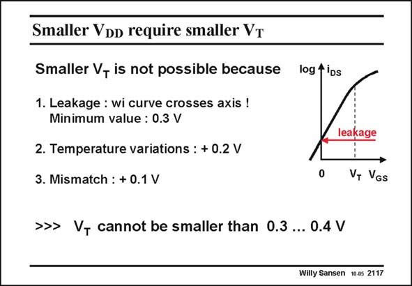

# SANSEN-2117 · Smaller Voo require smaller VT

章节：21 低功耗 ΣΔ 模数转换器  
PDF 页：635；书本页：646；幻灯片编号：2117  
状态：unreviewed



## 对应教材讲解

### PDF 634 · 书本 645

The first alternative is to lower the value of the V . Smaller V values require smaller V T DD T values! How far can this go? A small value of V causes the weak-inversion part of the i −v characteristic to cross the T DS GS axis of zero V . In other words, even for zero V , some current flows. This is called the leakage GS GS current. This means that all digital gates conduct current even when switched off. Lowering the V causes excessive power consumption. A minimum value seems to be about T 0.3 V (Ref. Rabaey). Most chips operate at higher temperatures, however. Chip temperatures of up to 100°C higher

### PDF 635 · 书本 646

than room temperature are common. Since the threshold voltage V decreases T with about 2 mV/°C, it can be 0.2 V lower than at room temperature. The leakage current is weak inversion depends on the V in an GS exponential way, increasing by nearly a factor of ten per 100 mV. At high chip temperatures, the leakage current can now be about 2 orders of magnitude larger. The choice of the V must T compensate this. The V T cannot be chosen too small! Values of 0.3 to 0.4 V have become common nowadays. Finally, mismatch causes a large spreading of the V values. The actual V value can thus be T T a lot lower than expected. Again, the leakage current depends on the V in an exponential way. GS The V cannot be selected too small! T

## 公式／性能结论候选摘录

以下为规则截取的原文，尚未逐项判读。

- PDF 635: Since the threshold voltage V decreases T with about 2 mV/°C, it can be 0.2 V lower than at room temperature.
- PDF 635: The leakage current is weak inversion depends on the V in an GS exponential way, increasing by nearly a factor of ten per 100 mV.
- PDF 635: The actual V value can thus be T T a lot lower than expected.
- PDF 635: Again, the leakage current depends on the V in an exponential way.

## 曲线结论候选摘录

以下为规则截取的原文，尚未逐项判读。

- PDF 634: A small value of V causes the weak-inversion part of the i −v characteristic to cross the T DS GS axis of zero V .

## 原文条件与近似候选摘录

以下为规则截取的原文，尚未逐项判读。

（未由规则找到；不代表原页没有此类内容。）

## 幻灯片 OCR（未校正）

```text
Smaller Voo require smaller VT
Smaller V- is not possible because
log fiDs
1. Leakage : wi curve crosses axis !
Minimum value : 0.3 V
2. Temperature variations: + 0.2 V
3. Mismatch : + 0.1 V
>>> V, cannot be smaller than 0.3 ... 0.4 V
leakage
V, VGs
Willy Sansen 10.05 2117
```

数学上下标、分数及正负号以原图为准。电路图已保留；未核对的连接不输出成可仿真 netlist。
