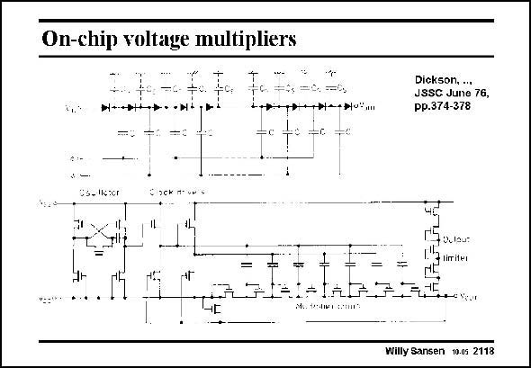

# SANSEN-2118 · On-chip voltage multipliers

章节：21 低功耗 ΣΔ 模数转换器  
PDF 页：635；书本页：646；幻灯片编号：2118  
状态：unreviewed



## 对应教材讲解

### PDF 635 · 书本 646

Voltage multipliers are used to generate DC voltages which are higher than the supply voltage V . This DD high voltage is now used to drive the Gates of the nMOST switches. Little current is required as they only drive Gates. They can therefore be realized with little additional power. They consist of a series of diodes and capacitors organized in a number of stages. Instead of diodes, diodeconnected MOSTs can be used. They are driven by an oscillator. The larger the number of stages, the higher the output voltage. The larger the capacitors the larger the output power. The most important parameter is doubtless the power efficiency. This has improved many times since the original reference. This is why more attention is paid to it.

## 公式／性能结论候选摘录

以下为规则截取的原文，尚未逐项判读。

- PDF 635: They can therefore be realized with little additional power.

## 曲线结论候选摘录

以下为规则截取的原文，尚未逐项判读。

（未由规则找到；不代表原页没有此类内容。）

## 原文条件与近似候选摘录

以下为规则截取的原文，尚未逐项判读。

（未由规则找到；不代表原页没有此类内容。）

## 幻灯片 OCR（未校正）

```text
On-chip voltage multipliers
•H+
Dickson, ...
JSSC June 76,
pp.374-378
+P•1*•H-HU:
*=C =0
Cs-lleter
BoCkMvNS
9 0uau:
- liritei
+IAA
MeGeohet eonn"
*-Yeur
Willy Sansen 10.05 2118
```

数学上下标、分数及正负号以原图为准。电路图已保留；未核对的连接不输出成可仿真 netlist。
