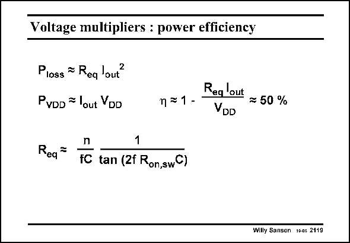

# SANSEN-2119 · Voltage multipliers : power efficiency

章节：21 低功耗 ΣΔ 模数转换器  
PDF 页：636；书本页：647；幻灯片编号：2119  
状态：unreviewed



## 对应教材讲解

### PDF 636 · 书本 647

The actual power efficiency g can be expressed in terms of an equivalent resistor R . eq It is also clearly a function of the output current. This loss resistor R is eq proportional to the number of stages n, but inversely proportional to the clock frequency f and the size of the capacitor C used. There is an additional non-linear factor in this expression, which includes the switch resistance. This factor is less important to have an idea about the orders of magnitude. It can be concluded that a voltage multiplier generates an output voltage with the highest efficiency, provided as few stages are used as possible, but with the highest possible capacitor and clock frequency. Unfortunately, these are exactly the same conditions for a maximum of injection of spikes in the substrate. Coupling to the sensitive analog parts can now be expected. This will be discussed in more detail in Chapter 24.

## 公式／性能结论候选摘录

以下为规则截取的原文，尚未逐项判读。

- PDF 636: This loss resistor R is eq proportional to the number of stages n, but inversely proportional to the clock frequency f and the size of the capacitor C used.

## 曲线结论候选摘录

以下为规则截取的原文，尚未逐项判读。

（未由规则找到；不代表原页没有此类内容。）

## 原文条件与近似候选摘录

以下为规则截取的原文，尚未逐项判读。

- PDF 636: It can be concluded that a voltage multiplier generates an output voltage with the highest efficiency, provided as few stages are used as possible, but with the highest possible capacitor and clock frequency.

## 幻灯片 OCR（未校正）

```text
Voltage multipliers : power efficiency
Ploss = Req lout?
PvDD = lout YDD
Req lout
n=1-
= 50 %
VDD
1
Req
tC tan (2f Ron,swC)
Willy Sansen 100s 2119
```

数学上下标、分数及正负号以原图为准。电路图已保留；未核对的连接不输出成可仿真 netlist。
