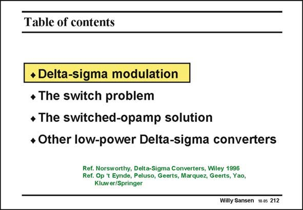

# SANSEN-212 · Table of contents

章节：21 低功耗 ΣΔ 模数转换器  
PDF 页：626；书本页：637；幻灯片编号：212  
状态：unreviewed



## 对应教材讲解

### PDF 626 · 书本 637

To initiate this Chapter, a few essential aspects of Delta-Sigma converters are reviewed. This is a very short introduction to Delta- Sigma converters. For more thorough understanding, the reader is referred to more detailed references such as Northsworthy (Wiley), Schreier (Wiley) and Johns-Martin (Wiley). Most low-power Delta- Sigma converters use switched-capacitor filters for the noise shaping. Switches become a problem however, for such low supply voltages. They are discussed first. Rather than use switches, the opamps can be switched themselves. Today, many very-lowvoltage Sigma-Delta converters use this technique. The principle will be explained, followed by a number of design examples. Finally, some of the most recent low-voltage Delta-sigma converters are discussed. Some of

### PDF 627 · 书本 638

them use series resistors at the input, some others use full feedforward. They are discussed and compared on the basis of a commonly agreed Figure of Merit.

## 公式／性能结论候选摘录

以下为规则截取的原文，尚未逐项判读。

（未由规则找到；不代表原页没有此类内容。）

## 曲线结论候选摘录

以下为规则截取的原文，尚未逐项判读。

（未由规则找到；不代表原页没有此类内容。）

## 原文条件与近似候选摘录

以下为规则截取的原文，尚未逐项判读。

（未由规则找到；不代表原页没有此类内容。）

## 幻灯片 OCR（未校正）

```text
Table of contents
• Delta-sigma modulation
• The switch problem
• The switched-opamp solution
• Other low-power Delta-sigma converters
Ref. Norsworthy, Delta-Sigma Converters, Wiley 1996
Ref. Op t Eynde, Peluso, Geerts, Marquez, Geerts, Yao,
Kluwer/Springer
Willy Sansen 10.05 212
```

数学上下标、分数及正负号以原图为准。电路图已保留；未核对的连接不输出成可仿真 netlist。
