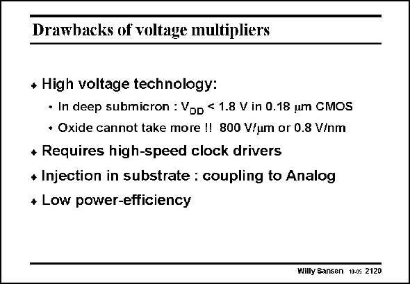

# SANSEN-2120 · Drawbacks of voltage multipliers

章节：21 低功耗 ΣΔ 模数转换器  
PDF 页：636；书本页：647；幻灯片编号：2120  
状态：unreviewed



## 对应教材讲解

### PDF 636 · 书本 647

Voltage multipliers show several more drawbacks. They generate higher voltage than the supply voltage. Care must be taken not to exceed the maximum voltage on the thin Gate oxides. At about 0.8 V/nm thickness an oxide breaks down. A CMOS technology of 0.18 mm has an oxide thickness of about 1/50th or 3.6 nm. This would break down under a voltage of about 2.9 V. The standard supply voltage for 0.18 mm CMOS is 1.8 V. This is sufficiently far from the breakdown voltage. However, if voltage multiplies are added, care has to be take not to end up too close to the breakdown voltage. If not, reliability issues appear. A CMOS technology of 90 nm has an oxide thickness of about 1.8 nm, corresponding to a breakdown voltage of about 1.5 V. The supply voltage is 1.3 V. Voltage multipliers are therefore excluded!

### PDF 637 · 书本 648

Another disadvantage of voltage multipliers is that clock drivers are required to drive all the capacitors. They take additional power and cause large spikes into the substrate. Substrate noise and coupling is now hard to avoid.

## 公式／性能结论候选摘录

以下为规则截取的原文，尚未逐项判读。

- PDF 636: Voltage multipliers are therefore excluded!

## 曲线结论候选摘录

以下为规则截取的原文，尚未逐项判读。

（未由规则找到；不代表原页没有此类内容。）

## 原文条件与近似候选摘录

以下为规则截取的原文，尚未逐项判读。

（未由规则找到；不代表原页没有此类内容。）

## 幻灯片 OCR（未校正）

```text
Drawbacks of voltage multipliers
* High voltage technology:
• In deep submicron : VoD < 1.8 V in 0.18 um CMOS
• Oxide cannot take more !! 800 V/um or 0.8 V/nm
* Requires high-speed clock drivers
+ Injection in substrate : coupling to Analog
* Low power-efficiency
Willy Sansen 10.05 2120
```

数学上下标、分数及正负号以原图为准。电路图已保留；未核对的连接不输出成可仿真 netlist。
