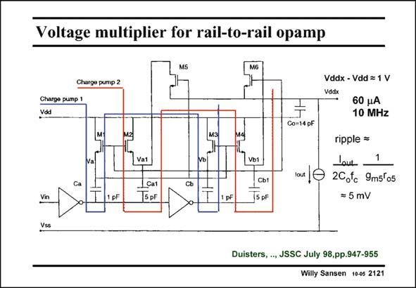

# SANSEN-2121 · Voltage multiplier for rail-to-rail opamp

章节：21 低功耗 ΣΔ 模数转换器  
PDF 页：637；书本页：648；幻灯片编号：2121  
状态：unreviewed



## 对应教材讲解

### PDF 637 · 书本 648

An interesting example of a voltage multiplier, which has been designed according to the rules of the previous slides, is given in this slide. It provides an output voltage which tracks the supply voltage V but is DD always 1 V higher. This difference of 1 V is used to realize a rail-to-rail input amplifier with only one single input pair (see Chapter 11). As a result, the distortion can be made less than −80 dB. This operates with only two stages but with a fairly high clock frequency of 10 MHz. The capacitors are selected fairly small. The ripple on this DC supply has been reduced by taking a large capacitor C . Together with the voltage gain of transistor M5, this capacitor C allows a o o reduction of the ripple to a mere 5 mV, for a 60 mA output current. This was necessary as the voltage multiplier is not used only for Gate drives but to supply DC current to input differential pair. It works for supply voltages of 1.8 V to 3.3V. It has been realized in 0.5 mm CMOS. For more details the reader is referred to the paper in reference.

## 公式／性能结论候选摘录

以下为规则截取的原文，尚未逐项判读。

- PDF 637: As a result, the distortion can be made less than −80 dB.
- PDF 637: Together with the voltage gain of transistor M5, this capacitor C allows a o o reduction of the ripple to a mere 5 mV, for a 60 mA output current.

## 曲线结论候选摘录

以下为规则截取的原文，尚未逐项判读。

（未由规则找到；不代表原页没有此类内容。）

## 原文条件与近似候选摘录

以下为规则截取的原文，尚未逐项判读。

（未由规则找到；不代表原页没有此类内容。）

## 幻灯片 OCR（未校正）

```text
Voltage multiplier for rail-to-rail opamp
Charge pump 2
Charge pump 1
Vod
Mg
Ca
Vin
1 pF
Vat
Cat
15 pF
vo
сь
1 pF
Vbs
Сь1
_5 pF
Vddx - Vdd = 1 V
Vddx
60 uA
10 MHz
Co=14 pF
ripple =
Lout
tas 0 2C.tc 9mstos
= 5 mV
Vss
Duisters, .., JSSC July 98,pp.947-955
Willy Sansen 10-05 2121
```

数学上下标、分数及正负号以原图为准。电路图已保留；未核对的连接不输出成可仿真 netlist。
