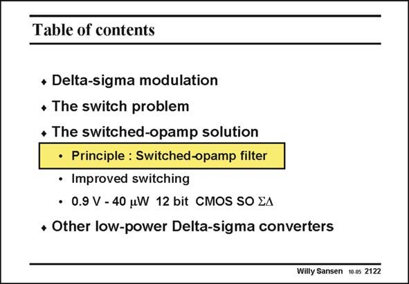

# SANSEN-2122 · Table of contents

章节：21 低功耗 ΣΔ 模数转换器  
PDF 页：637；书本页：648；幻灯片编号：2122  
状态：unreviewed



## 对应教材讲解

### PDF 637 · 书本 648

If switches cannot be used any more because of the low supply voltage, the whole opamp can be switched. This is called the switchedopamp approach. This is discussed next. The principles are explained first, followed by a few realizations.

## 公式／性能结论候选摘录

以下为规则截取的原文，尚未逐项判读。

（未由规则找到；不代表原页没有此类内容。）

## 曲线结论候选摘录

以下为规则截取的原文，尚未逐项判读。

（未由规则找到；不代表原页没有此类内容。）

## 原文条件与近似候选摘录

以下为规则截取的原文，尚未逐项判读。

（未由规则找到；不代表原页没有此类内容。）

## 幻灯片 OCR（未校正）

```text
Table of contents
* Delta-sigma modulation
• The switch problem
+ The switched-opamp solution
• Principle : Switched-opamp filter
• Improved switching
• 0.9 V - 40 uW 12 bit CMOS SO EA
• Other low-power Delta-sigma converters
Willy Sansen 10.05 2122
```

数学上下标、分数及正负号以原图为准。电路图已保留；未核对的连接不输出成可仿真 netlist。
