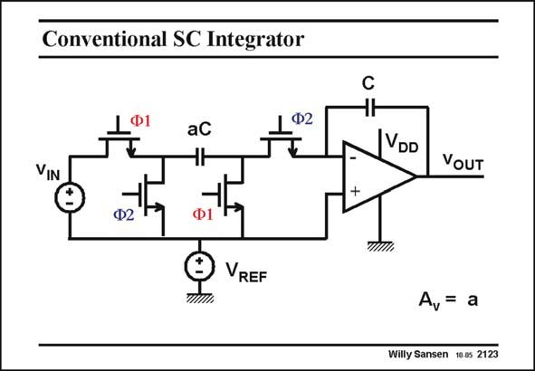

# SANSEN-2123 · Conventional SC Integrator

章节：21 低功耗 ΣΔ 模数转换器  
PDF 页：638；书本页：649；幻灯片编号：2123  
状态：unreviewed



## 对应教材讲解

### PDF 638 · 书本 649

In a conventional switchedcapacitor integrator, the input voltage v is sampled IN on capacitor aC, when phase W1 is high. The two MOSTs labeled W1 then conduct whereas the other two are off. On phase W2, the charge aCv is transferred to IN capacitor C. The resulting output voltage is now a multiplied by the input voltage; the voltage gain is a. When a single supply voltage V is used, a DC DD reference voltage V may have to be added, to make sure that the voltages at both the minus REF and plus inputs of the opamp never exceed the common-mode input range. A typical value is 0.2 V depending on the type of opamp. The main problem of this integrator when the supply voltage is small, is the input switch. Indeed, if we take as an input voltage 0.5 V for a supply (and clock) voltage of 1 V (V = REF 0.2 V), then all MOST switches receive a V of 0.8 V when switched in, except the input GS transistor. This latter one only receives 0.3 V and is not on at all! This is the problem.

## 公式／性能结论候选摘录

以下为规则截取的原文，尚未逐项判读。

- PDF 638: The resulting output voltage is now a multiplied by the input voltage; the voltage gain is a.
- PDF 638: A typical value is 0.2 V depending on the type of opamp.

## 曲线结论候选摘录

以下为规则截取的原文，尚未逐项判读。

- PDF 638: In a conventional switchedcapacitor integrator, the input voltage v is sampled IN on capacitor aC, when phase W1 is high.
- PDF 638: On phase W2, the charge aCv is transferred to IN capacitor C.

## 原文条件与近似候选摘录

以下为规则截取的原文，尚未逐项判读。

（未由规则找到；不代表原页没有此类内容。）

## 幻灯片 OCR（未校正）

```text
Conventional SC Integrator
1º2
VIN
Ф2
VREF
VDD
VOUT
+
A = a
Willy Sansen 10.05 2123
```

数学上下标、分数及正负号以原图为准。电路图已保留；未核对的连接不输出成可仿真 netlist。
