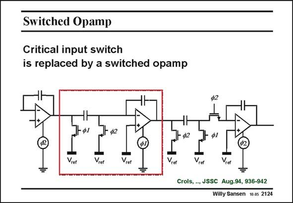

# SANSEN-2124 · Switched Opamp

章节：21 低功耗 ΣΔ 模数转换器  
PDF 页：638；书本页：649；幻灯片编号：2124  
状态：unreviewed



## 对应教材讲解

### PDF 638 · 书本 649

A solution is obtained by switching the preceding opamp. This obviously only works if several switchedcapacitor integrators are put in series. Take the integrator in the frame. Its input switch on phase w2 has been shifted to the preceding opamp. The whole opamp is switched in and out at clock phase w2. In a similar way, the opamp within the frame is switched in and out at clock phase w1, in order to be able to provide the input voltage to the next integrator. The last opamp shown is now switched at clock phase w2. It is easier to realize an opamp with a low supply voltage than to realize an input switch with a low supply (or clock) voltage. Moreover, it is fairly straightforward to switch an opamp. This is discussed next.

### PDF 639 · 书本 650

The only problem left is the very first input switch. At the input, a compromise will have to be taken for the maximum input voltage. Alternative solutions will be discussed later in this Section.

## 公式／性能结论候选摘录

以下为规则截取的原文，尚未逐项判读。

（未由规则找到；不代表原页没有此类内容。）

## 曲线结论候选摘录

以下为规则截取的原文，尚未逐项判读。

- PDF 638: Its input switch on phase w2 has been shifted to the preceding opamp.
- PDF 638: The whole opamp is switched in and out at clock phase w2.
- PDF 638: In a similar way, the opamp within the frame is switched in and out at clock phase w1, in order to be able to provide the input voltage to the next integrator.
- PDF 638: The last opamp shown is now switched at clock phase w2.

## 原文条件与近似候选摘录

以下为规则截取的原文，尚未逐项判读。

（未由规则找到；不代表原页没有此类内容。）

## 幻灯片 OCR（未校正）

```text
Switched Opamp
Critical input switch
is replaced by a switched opamp
-ф1
ф2
- ф2
ф1
Vret
Vrer
Vrer
Vier
Vret
Vret
Crols, .., JSSC Aug.94, 936-942
Willy Sansen 10.05 2124
```

数学上下标、分数及正负号以原图为准。电路图已保留；未核对的连接不输出成可仿真 netlist。
