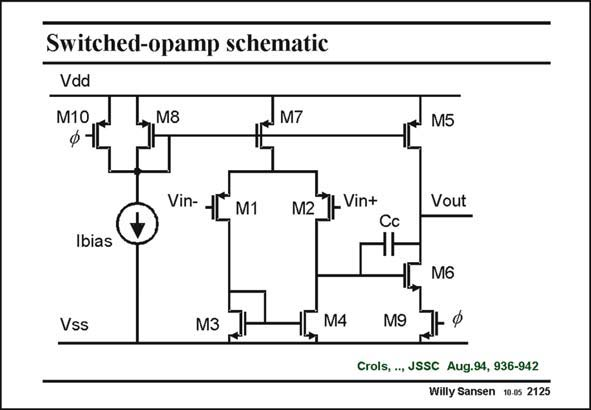

# SANSEN-2125 · Switched-opamp schematic

章节：21 低功耗 ΣΔ 模数转换器  
PDF 页：639；书本页：650；幻灯片编号：2125  
状态：unreviewed



## 对应教材讲解

### PDF 639 · 书本 650

The very first switched opamp is shown in this slide. It is a two-stage Miller opamp, to which two switches have been added, i.e. nMOST M9 and pMOST M10. When the voltage of clock phase w is high, M10 is off and M9 is on. The opamp functions as expected. When the voltage of clock phase w is low however, M10 is on and shorts the Gate voltage of transistors M8, M7 and M5 to the supply lines. All these transistors are therefore off. Also, M9 is off. Both stages of the opamp are switched off. How fast can an opamp be switched on and off depends on the loop gain of the feedback arrangement. If the gain around the opamp is a, then its bandwidth is GBW/a. The corresponding time constant for the output voltage is also the time constant for the switching in and out of the whole opamp. This is shown next.

## 公式／性能结论候选摘录

以下为规则截取的原文，尚未逐项判读。

- PDF 639: All these transistors are therefore off.
- PDF 639: How fast can an opamp be switched on and off depends on the loop gain of the feedback arrangement.
- PDF 639: If the gain around the opamp is a, then its bandwidth is GBW/a.

## 曲线结论候选摘录

以下为规则截取的原文，尚未逐项判读。

- PDF 639: When the voltage of clock phase w is high, M10 is off and M9 is on.
- PDF 639: When the voltage of clock phase w is low however, M10 is on and shorts the Gate voltage of transistors M8, M7 and M5 to the supply lines.

## 原文条件与近似候选摘录

以下为规则截取的原文，尚未逐项判读。

（未由规则找到；不代表原页没有此类内容。）

## 幻灯片 OCR（未校正）

```text
Switched-opamp schematic
Vdd
M10
M8
M7
M5
Vin-
M1
M2 ]| Vin+
Cc
Vout
Ibias
M6
Vss
M3
M4
M9
Crols, .., JSSC Aug.94, 936-942
Willy Sansen 10.05 2125
```

数学上下标、分数及正负号以原图为准。电路图已保留；未核对的连接不输出成可仿真 netlist。
